2026年3月に、早稲田大学の人間科学部を卒業しました。
いろんな経験ができたよ年間について、振り返り形式で記録に残そうと思います。
学業のことは対して触れることがないので、人間科学部関連記事というわけではありません。あくまで私の大学生期間における、4年間を振り返るという内容の個人blogです。

## 2022/03 上京
雪も溶けきらぬ春の北海道。18まで育った北の大地から抜け出し、祖母宅がある東京板橋に向かって上京しました。
推薦受験で合格していたため早くから暇を持て余しており、せっかくの上京をを飛行機１本で済ましてはならぬとあれこれ考えた結果、青春18きっぷを使った鈍行旅を計画していました。
あゝなんと若さの愚かしい。

実家から苫小牧まで親に送ってもらい、深夜フェリーで八戸港まで。直前の夜に苫小牧の回転寿司に家族で訪れたのをなんとなく覚えています。これが最後の晩餐かぁ...って。
苫小牧港のフェリーターミナル建物前で車から降ろしてもらう瞬間の母親の寂しそうな顔を思い出して、フェリーの中で少し泣きました。

八戸港からは、青森、秋田、新庄、羽前千歳、仙台のカプセルホテルで一泊、福島、郡山、新白河、黒磯、宇都宮、池袋、板橋といった具合で、二日間かけてじっくりと上京しました。鈍行の車内でも、電車待ちの駅ホームでも、基本やることはありません。道央内陸部に住んでいた私にとって珍しかった海の景色を見ながらもあまり楽しめず、これからの新生活がただただ不安だったことを覚えています。

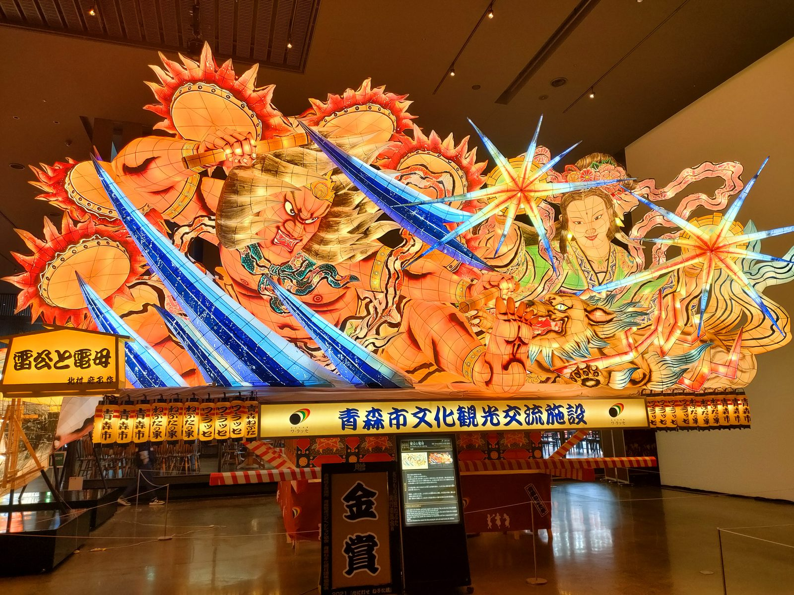

無事に祖母宅に着いてからは、大学入学に関わるいろんな書類に目を通したり、科目登録について情報を集めたり、サークルを考えたり、、という感じだったと思います。少なくとも写真を見返す限り、記録用にとった各種書類の写真しか出てきません。

ちょうど桜の時期だったので一度だけ、隅田川を歩いてスカイツリーを見つつ浅草観光をし、帰りに早稲田大学のキャンパスを見に行った日があることは覚えています。
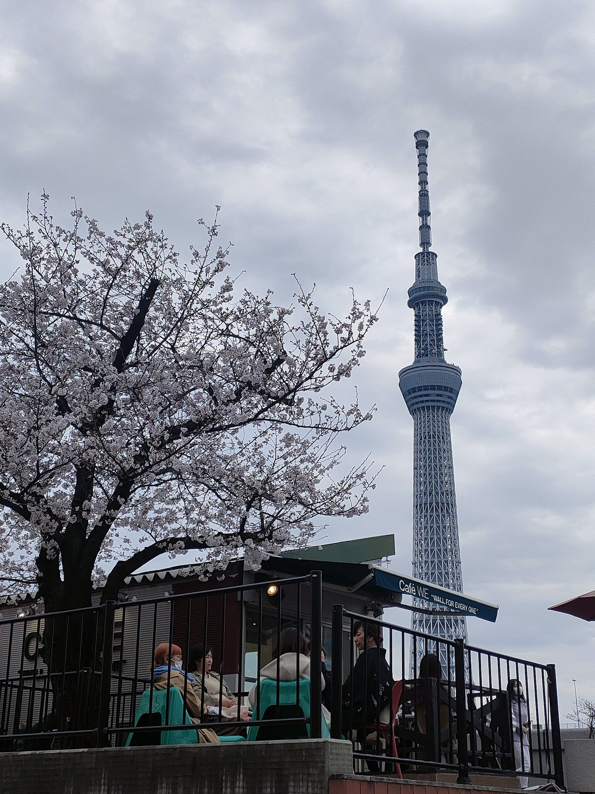
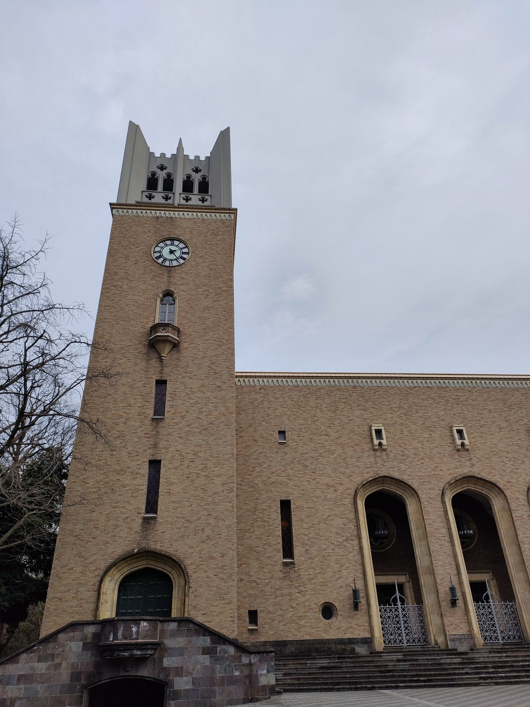

結局、早稲田キャンパスに通うことはないんですけどね笑
入学式前なのに結構人がいて、早稲田キャンパスに通うのは無理そうだなと思ったのを覚えています。人酔いしてしまう私にとっては所沢キャンパスにある人間科学部が好都合でした。一度もキャンパスを訪れずに推薦で決めたキャンパスだったのでラッキー。

ちなみに引っ越しについてですが、私はとにかく所有物が少ないタイプだったので、全て郵便で送るだけで全然事足りる程度の量しかありませんでした。(5箱くらい？うち2箱は本)
引越しが身軽に終われたのは、家電が全て揃っている祖母宅に居候させていただけたおかげです。家賃0の家が確約されている状況でなければ、そもそも上京という選択肢はなかったと思います。これはマジで感謝。

3月31日に、科目履修を仮組みしている写真を見つけました。
1年生の春学期から毎日登校前提で結構頑張ってますね笑
うっすら覚えていることとしては、1年春はとにかく友達作りが重要というのをなんとなく見聞きして理解しており、機会を最大化するためには全日登校すべきかなと思い、意図的に大変な感じで組んでたような気がします。
今考えると正気の沙汰じゃない。

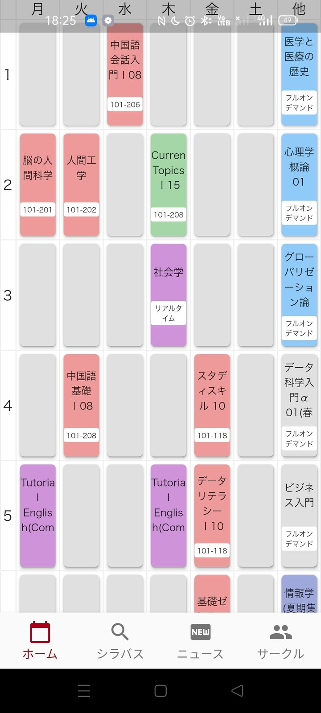

## 2022/04
成人年齢が18歳に引き下げられたりした時期です。
個人的に野球は興味ないですが、佐々木朗希がなんかすごそうだった時期です。

授業が始まります。
基本的に授業の内容には興味がないので、とにかく友達作りのためのムーブに全ベットして動いていたと思います。恥を忍んで隣の人に声をかけたり、ちゃんとLINE聞いたり。

サークルの新歓には、予定の合う限り死ぬほど行きまくりました。多分25サークルくらいは説明会聞いたし、対面新歓も行きました。
結局どれもしっくりこず、大量のよっ友LINEが残るだけでした。おかげで現在、友達が多いふりができています。

新歓の中で、会員になりたいと思える実際に入会したサークルはいくつかあります。
- 池袋地域の子どもと遊ぶサークル
- 古美術研究会(美術館行くだけのやつ)
- 情報系サークル
- 創作系サークルの皮を被ったTwitterやるだけのサークル
上3つはどれもとても楽しい活動だったのですが、キャンパスが遠かったり、活動日が合わなかったりなどでうまく馴染めず、フェードアウトしていきました。子どもと遊ぶやつはちゃんと行きたかったなぁ....。
結局、一番下のやつで友達を作っていくことになります。

当時の私は背中まで伸びるロン毛だったので、初対面場面での覚えられ方は尋常じゃなく、別に人当たりも愛想良くしていたので、結構無双でした。

複数のサークルの先輩方に、同時多発的に「菅田将暉に似てるね」といってもらったことは、今でもしがんでいます。本当にいろんな人からたくさん言われたんですよ。それはもう、誇張なしで10人くらいから。

当時は『百花』という映画のポスターがあちこちにあり、ロン毛の菅田将暉が全員の脳内に刻まれていたんだと思います。これまじで似てた本当に。映画は見てないです。

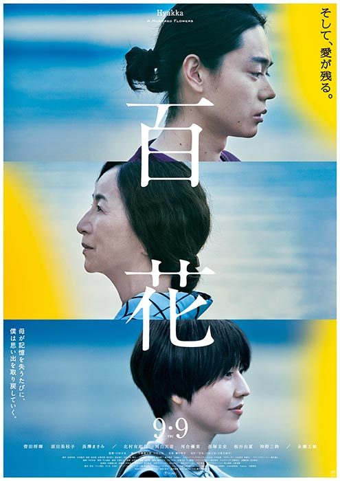

これぐらいから、Twitterで人との絡みが増えていきました。LINEと一緒に、Twitterやってる人はフォローしあったりしていったこともあり、コミュニケーションが増えていきました。

元々見ていた '#春から早稲田' '#春から人科'のコミュニティで、色々おもしろツイートしてた人と会えたりして嬉しかったし、Twitterで1分ごとにツイートしてる人がなんかカッコよく見えていました。 
そいつ、ただツイ廃なだけだよ。
普通にいろんな人と繋がっていき、やはり自分もTwitterどっぷりになっていき、向こう1年は主にTwitterが楽しかった時期になりました。

日常で見つけたおもしろを共有したらいいねがもらえるという体験が嬉しかったのは覚えています。
道に落ちてたキウイを、ツイートしたくてわざわざ10歩くらい戻って写真撮ったのを覚えています。
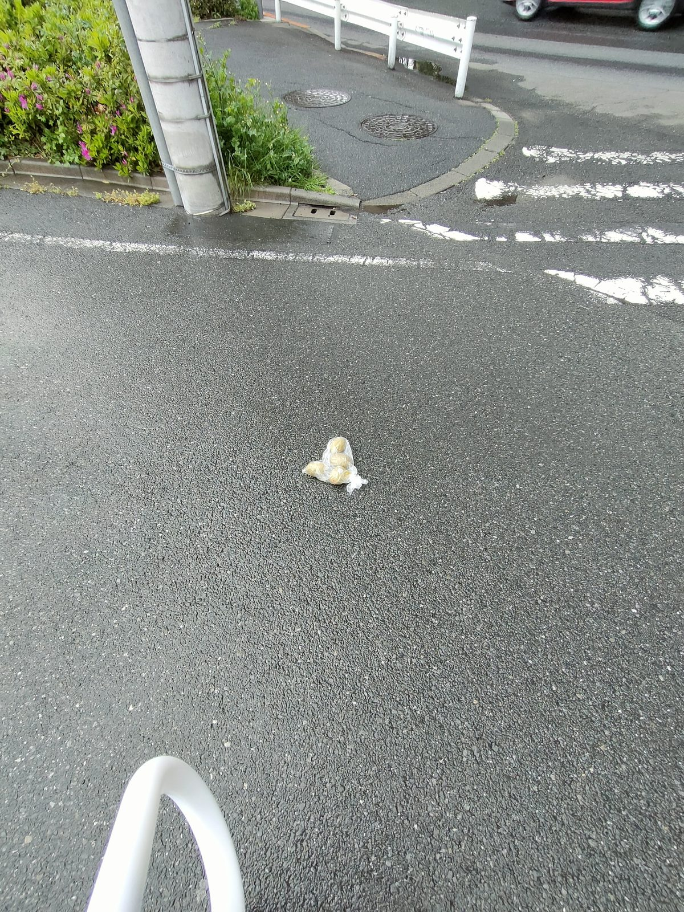

授業に慣れてくると、所沢キャンパスという環境についてなんとなく俯瞰できるようになり、自然が多くて人が(早稲田キャンパスに比較して)少ないこの場所の、なんと素晴らしいことか！と思ったりしていました。
今は、普通に遠いのでダルくて行きたくないです。

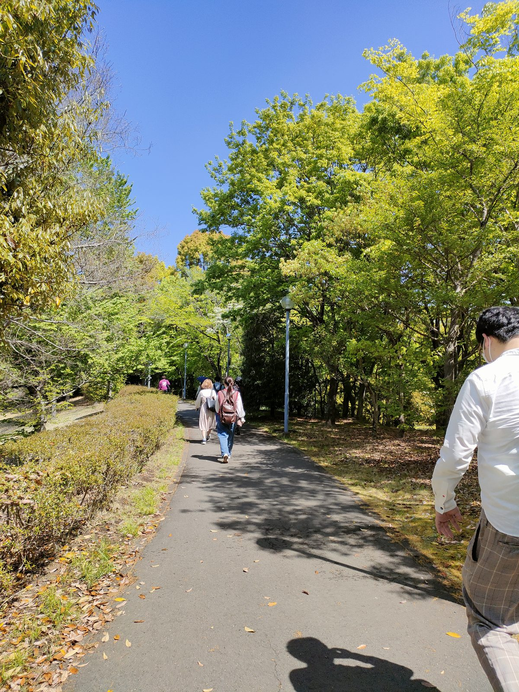

## 2022/05
AppleがiPodの終了を発表しました。初めてのスマホ?がiPod touchだったので、普通に悲しかったのを覚えています。
あと、4630万円の誤送金がありましたね。僕も誤送金されたい。

上京を青春18きっぷでやったのが忘れられなくて、5月頭に弾丸草津温泉旅に行ってますね。バイタリティがすごい。
草津旅は、同じ高校から一緒に上京した友人と2人で行きました。彼とは4年間、定期的に飲みに行っていて、大学卒業後も東京に残るらしいので、生来の友達になっていくのだろうと思います。いいやつです。

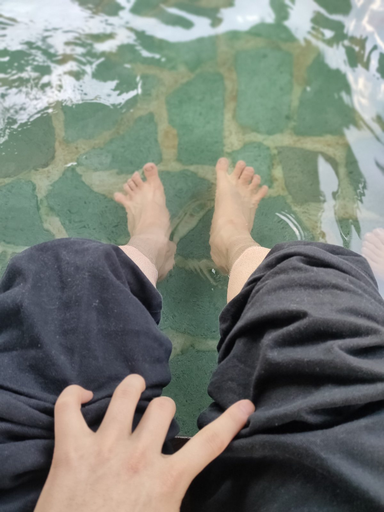

そして立て続けに、ディズニーにいくことになります。
サークルの新歓でした。
普通に頑張りすぎていたかなと思います。体力がすごい。

ここら辺から本当に、写真がTwitterのスクショばっかりになります。
会話も、"初期人間関係ハイ"な感じがあって、今見るとむず痒い。

そしてぼちぼち、大学で3年くらい付き合った彼女とのLINEが始まっています。
手がはやい。

5月の中旬には、スカイツリーで開催されていたJOJOコラボに参加していますね。
ちょっとしかJOJO知らなかったけど、ツイ廃仲間のみんなが行くって言っていて、親密度上昇イベントを逃したくなくて行ったのを覚えています。
家に帰ってから「何やってんだろ...」ってなって辛いやつになったので、普通に諸々かなり焦りすぎだったと思います。でも、ハイになってやらないとできないこともあったし、結局楽しい人間関係が色々作れたので良かったと思っています。

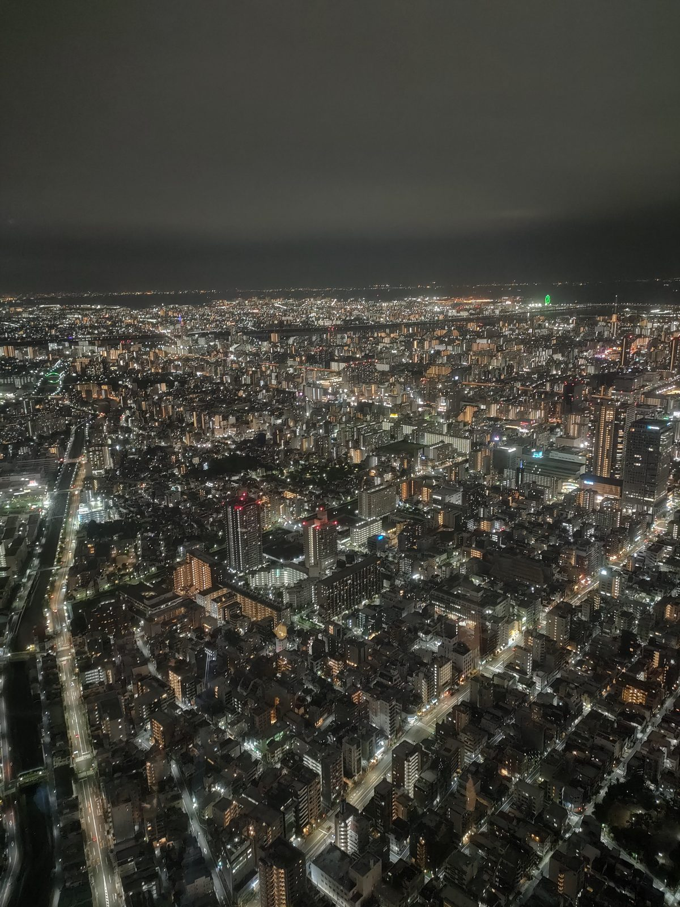

月の下旬には、地元中学の友達と成田山の神社?に行ったりもしていますね。なんかの研修？で東京に用事があるらしく。
この月の出費やばいんじゃないですかね。普通に金使いすぎやろ。

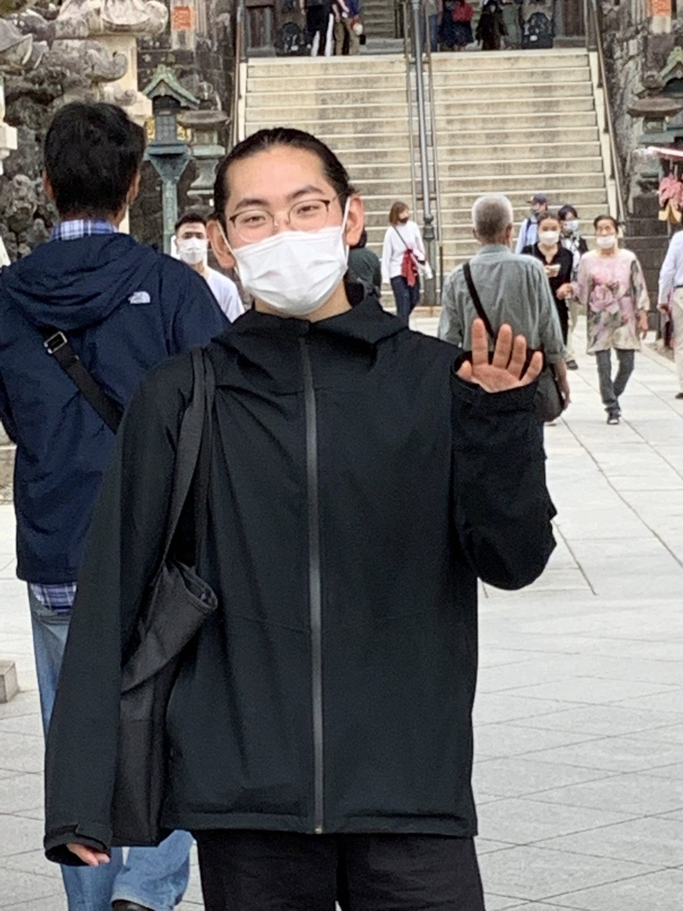
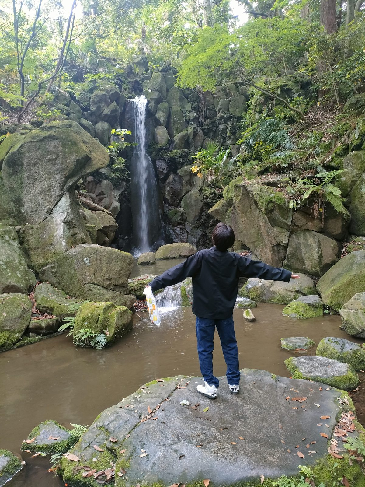

Twitterサークルの友人との遊びが色々乱立していくに伴い、サークルの部室でのわいわい時間が増えたり、二郎ラーメンを覚えたりしていきました。どれも大学生らしい思い出で、振り返ると人生の資産になっているような気がします。

ただカラオケだけはあんまり得意じゃなかったです。
歌自体はそんなに下手なわけじゃないと思うのですが、人前で、歌声を聴かれながら歌うというのはなんか得意になれませんでした。
大学に入るまで、ほとんどカラオケに行ったことがなかったため、慣れが原因かななんて思ってヒトカラに行ったりもしましたが、やっぱりあんまり楽しく思えないまま終わりました。

## 2022/06
東京は梅雨は軽くて、梅雨に怯えていた自分には拍子抜けでした。
逆に尋常じゃない猛暑がありました。本当に辛くて、猛暑のストレスで皮膚が荒れて、乾癬っぽい症状が出始めていました。本当に辛かった。
あと、Internet Explorerが終了して、TwitterはIE葬式の話題な感じだった記憶です。

なんの文脈でそうなったか忘れましたが、のちに一緒にサークルを立ち上げることになる女性(とあともう1人くらいいたかな？)に、一風堂のおいしさを教えてもらいました。マジで美味しい。

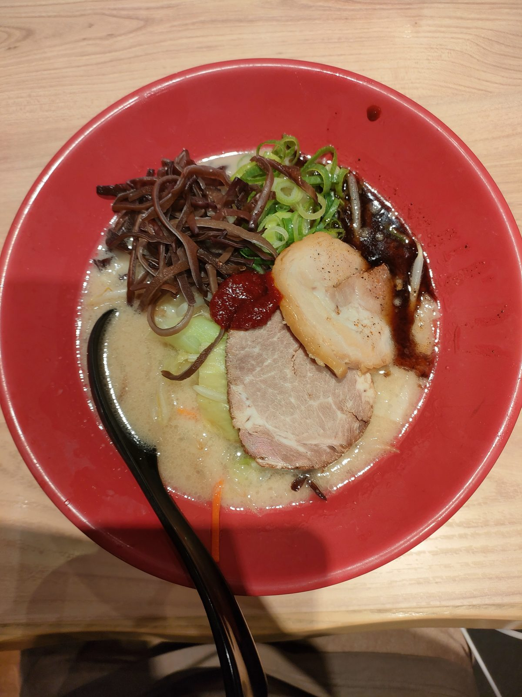

二郎を教えてくれたのは別の男性で、彼が教えてくれる二郎は本当に美味しかったし楽しかったです。
流石に最近は健康も考えて行けてないし、胃も小さくなってしまったけど、なぜかまた行きたい。この感情を二郎と呼ぶのだということも教えてもらいました。

また別の男性は、僕にラーメン中本も教えてもらいました。そんなに辛いのが得意じゃなかったですが、その時は友達バフもかかっていて美味しく感じました。その後何回かイキって行った後、徐々に上げていた辛さは最終的に辛さ8になり、そこで尋常じゃなくお腹を壊してしまいます。以降、辛いものを一切受け付けない体となり、これにて辛党からは離脱し、甘党に合流することと相成ります。

この頃には、基礎ゼミ(言ってしまえば授業のクラス)で仲良くなった男性3人と、4人組で授業後に夜ご飯を食べにいくムーブが固定化していきました。彼らとの夜ご飯は、クラスが終了する大学2年の春学期まで続き、とても思い出深く大切な人間関係になっていきました。今ではほとんど連絡とってないけど。

とにかく、サークルやら授業やらの友達と飯に行くことがかなり増えました。
本当にいくら金使ってるんだろう。考えたくないね。

## 2022/07
安倍首相が銃撃され、大阪万博のキャラがミャクミャクに決まりました。
ミャクミャクは結局大成功キャラみたいな感じになりましたね笑

多分ここら辺で、彼女と付き合います。
大学入って3ヶ月です。手が早いですね。
大学では最低1人とは交際したいなと思っていたので、早々と目標達成です。3年も続くとは思ってなかったけど。

写真を見返すと、ここら辺からなぜかCHILL OUTというエナドリの写真がすごく増えています。
なんかハマっていて、箱で買ってたと思いますし、なぜ写真に残っているかというと都度都度ツイートしてCHILL OUT好きなやつイキリをしていたからです。
これは本当にきしょい。
後に中学の友達にこのイキリツイートがバレて、ちょっと馬鹿にされます。

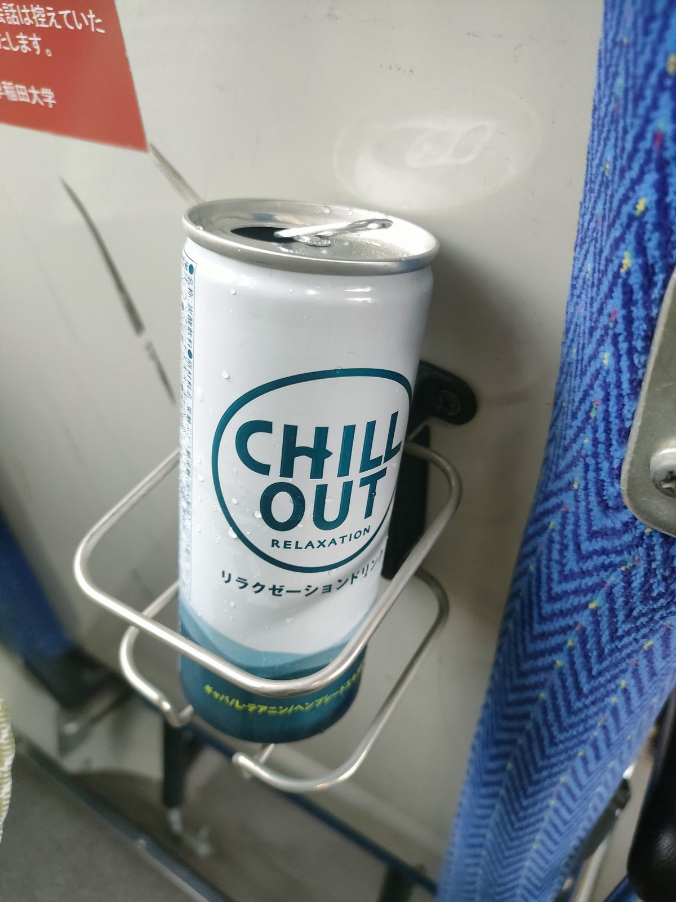
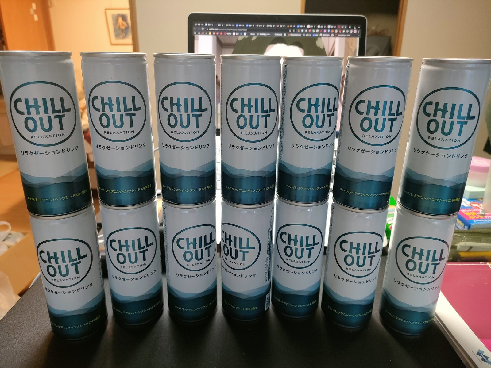

Twitterサークルの界隈の中で、「スクールバスの一番後ろの中央の席に座り、『玉座〜』みたいなツイートをする」というノリが流行ったのですが、これをよくやってたりしました。もしかしたら僕が作り出したノリだったりするのかな。マジでつまんないよねこれ笑

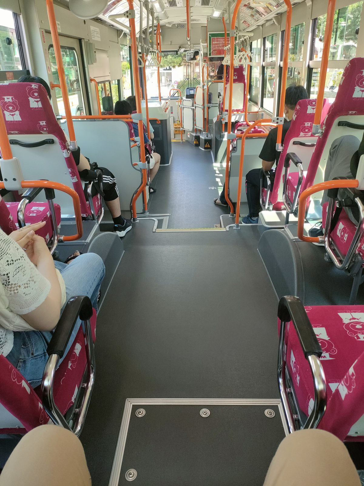

ここら辺で、池袋二郎の夏の限定のバジル汁なしを食べてますね。あとD麺も。
これを教えてくれた彼に最大級の感謝を。おかげで、ここら辺からラーメン大好きです。
彼はバンド活動を頑張ってるみたい？です。遠巻きに、すっごく応援しています。かっこいい。

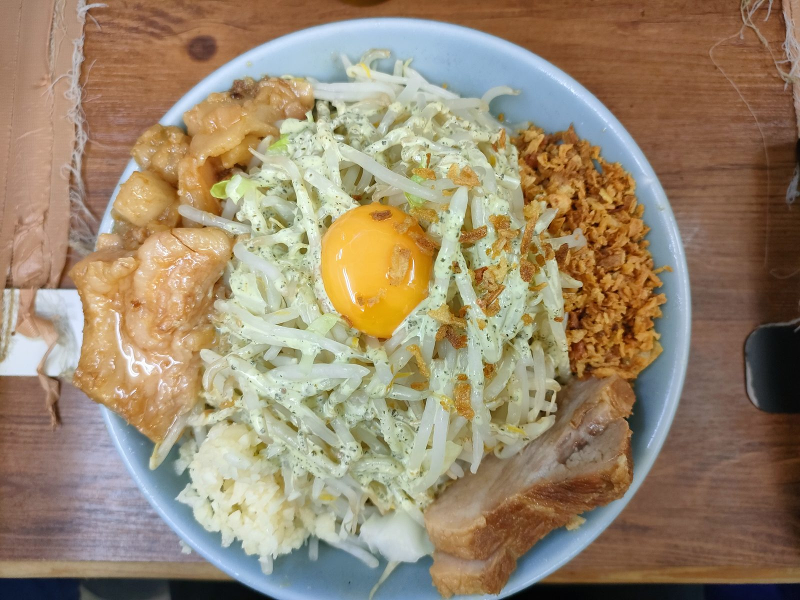
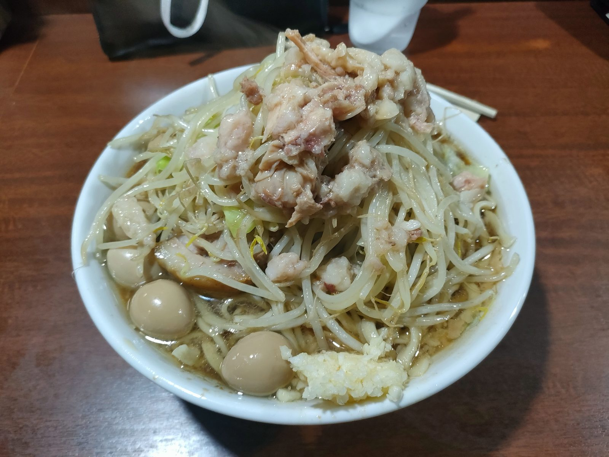

## 2022/08
『ONE PIECE FILM RED』が公開され、世の中Ado!Ado!だった記憶です。もちろん観てないです。
東北・北陸で記録的大雨がありました。これに思いっきり引っかかる旅程で旅をしていたのが8月です。

4月に青春18きっぷで上京ひとり旅をした経験が忘れられないまま、夏が来ました。
青春18きっぷは、学生の休業時期に合わせて発行されます。
行くしかありませんでした。

計画としては、上京で来た旅路をそのまま戻るような形。
春に川を下った鮭の稚魚は、その旅路の興奮が忘れられず、秋を待たずに故郷へ戻ろうとしました。

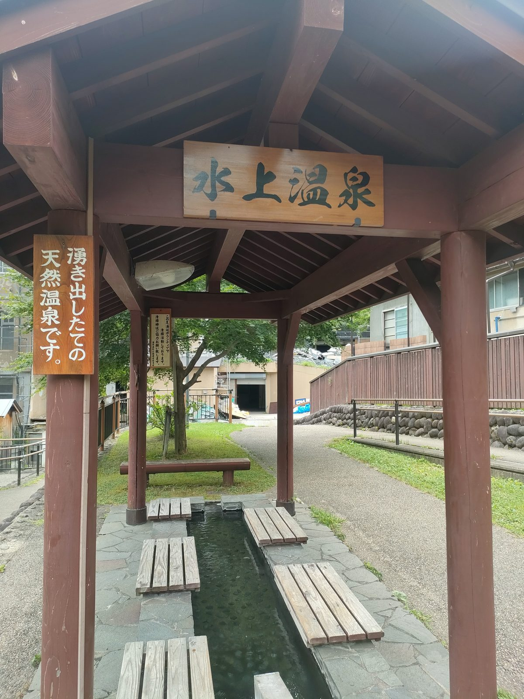
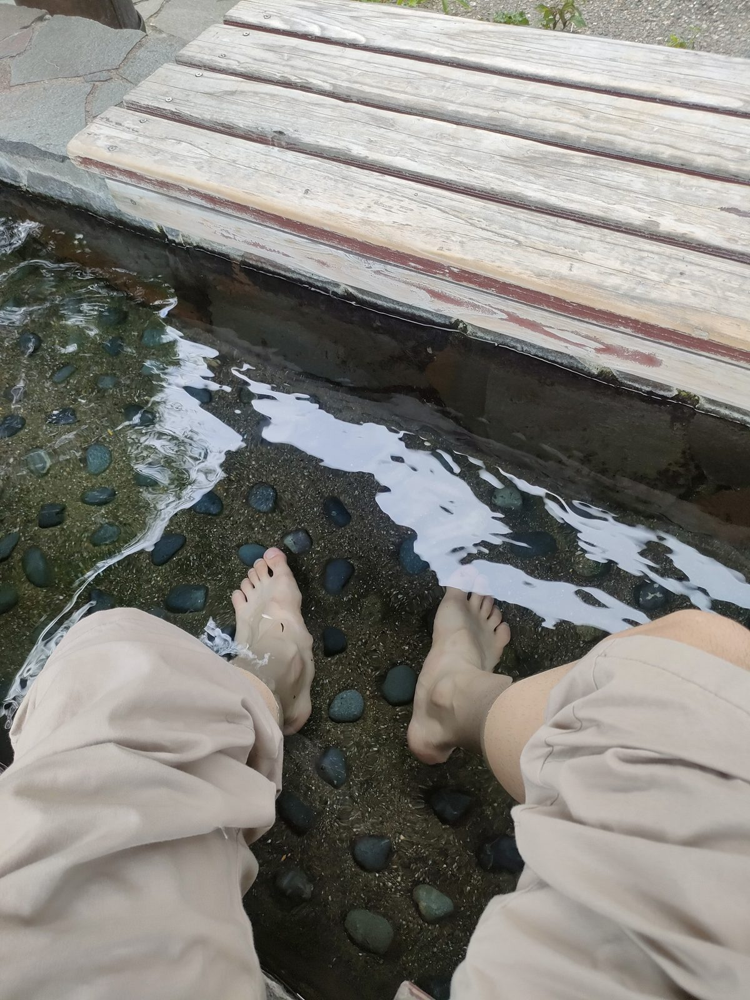

春は仙台側から南下したので、今度は新潟側から北上してみよう。
この楽しそうな計画が間違いでした。
先述した記録的な豪雨が新潟を襲い、新潟からさらに北上する路線の電車がストップします。
尋常じゃない湿度と気温の中、何もできずに新潟駅に放り出されたのを覚えています。

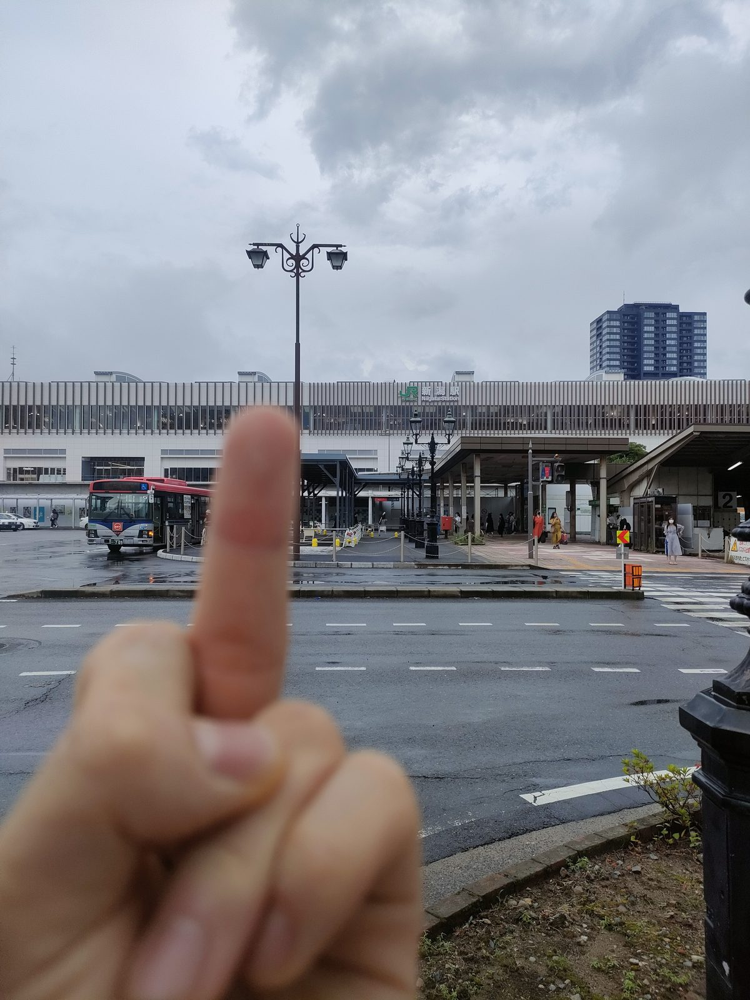
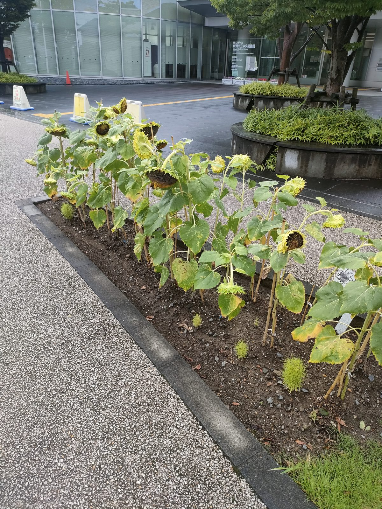

数日間鈍行で揺られたストレスか、上京以来、悩まされていた本州の気温の暑さか、ここで私の身体にかかっていたストレスが爆発し、以前から少しそのケがあった乾癬っぽい症状が上半身にガバッと現れます。
急遽訪れた新潟の皮膚科で薬をもらい、よくわかんない駅前のネットカフェで、不安いっぱいの一晩を過ごしたのを思い出しました。

元々そんなに体が強いってわけでもないのに、やはりハイになって色々やりすぎていました。
この皮膚の症状は回復とぶり返しを往復しながら、その年の年末にかけてゆっくりと治っていきます。
人生で記憶にある限り、初めての「原因不明の病」だったので、かなりメンタルやられていたのを覚えています。結構美容は気にしていたので、顔面に赤いまだら模様があったのがすごく辛かったです。後普通にジンジン痛かった。

旅路の方はと言うと、新潟以北の路線が復旧する見込みが多々ないとのことで、翌日からは一度南下し、仙台側まで行ってから北上し直すことにしました。

名前忘れたけど、有名な祭りの有名なやつが展示されてて、タイミング良かった
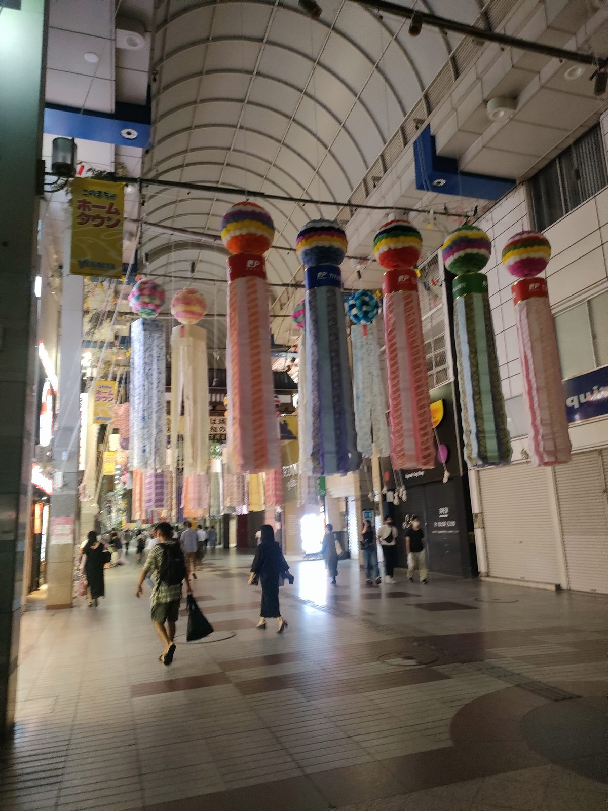

そこからは、上京旅程の巻き戻しです。
「半年前に見たなぁ〜」って思いながら、鈍行に揺られていきました。
今回は苫小牧港についてからも引き続き電車で実家を目指しました。親は迎えに来てくれようとしていましたが、北海道の路線の車窓を見てみたかったため断りました。

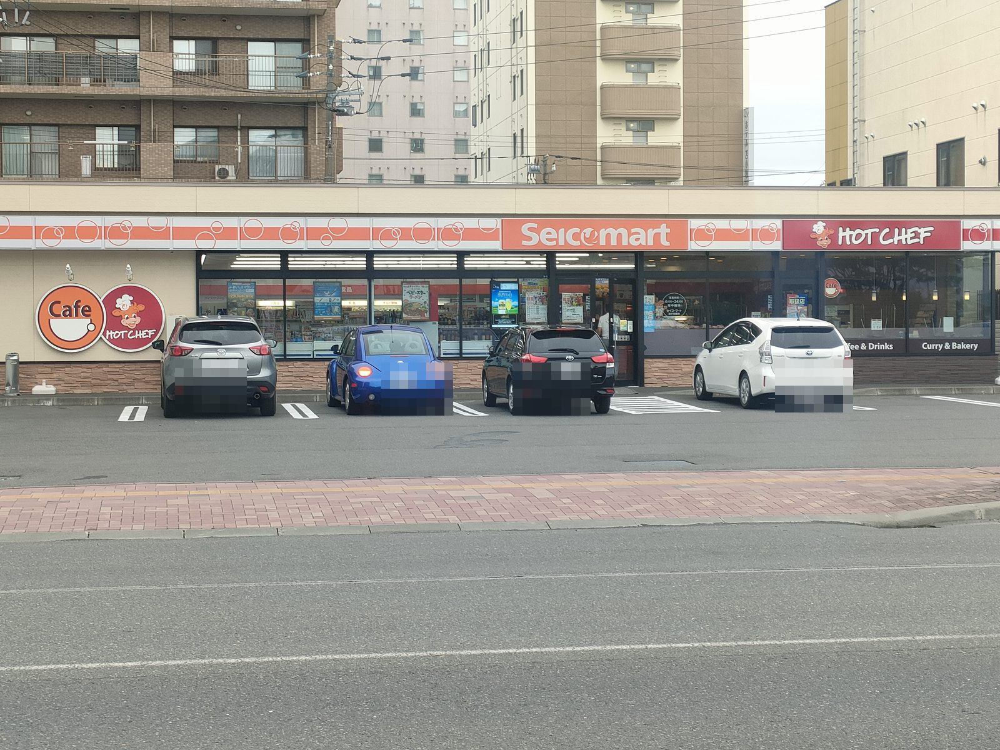

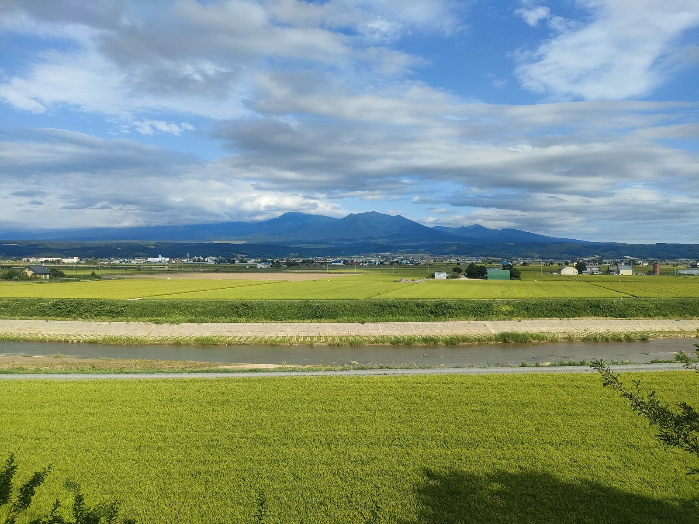

実家に着いてから、すぐに熱を出して寝込みました。
だから言わんこっちゃない。
皮膚の赤い斑点の症状も含め、親に心配をかけたなぁと思います。
それ以降、帰省するたびに皮膚の状態について聞かれます。東京に遣った息子が病気して帰ってきたらそりゃ心配だよね。

本当は帰省の帰路も鈍行列車旅の予定でしたが、飛行機で帰ることにしました。

旭川空港の近くにある、思い出のジェラート屋さんに
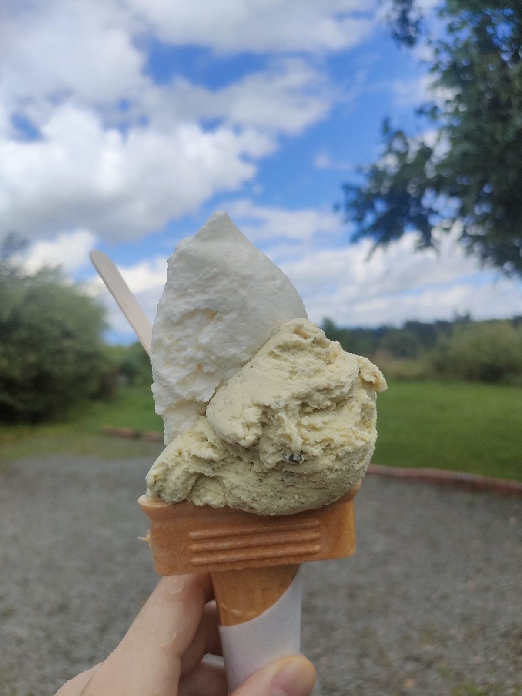

帰省してからは家で療養...かと思っていましたが写真を見ていると、東京に帰ってきて早々に彼女と水族館やらプラネタリウムやら行っていますね。
よく頑張ったな...僕...。

勝手に辛い旅路の中、勝手に19歳になりました。
## 2022/09
安倍首相の国葬があったり、ゼルダのティアキンが発表されました。
ティアキンはめっちゃアツかったし、実際面白かったけど、内容が膨大すぎて最後までやれないまま放置してしまっています。少なくとも近年で最高レベルのゲームだなぁとは思いますし、軒並み評価は高いイメージ。

8月の教訓を活かし、活動ハイにならず、自分のキャパに合った月にするぞ！
となるかと思っていたのですが全然そんなことはなく、9月頭からなぜか名古屋方面に向かう鈍行列車に乗っていました。
青春18きっぷです。

元々、「制度をハックして安く楽しむ」みたいなのが好きだったのもあって、当時の私は狂気をもって青春18きっぷを愛していました。
普通に体調悪いのに何やってんだ。

今回の名古屋方面旅は彼女と行っていたぶん、それぞれの地でちゃんと観光的なことをしていきました。

熱海の砂浜に行ったり。

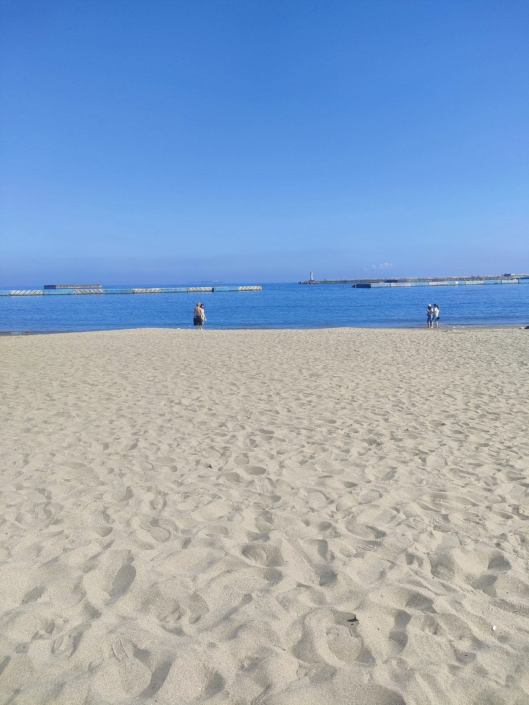

静岡でさわやかを食ったり。

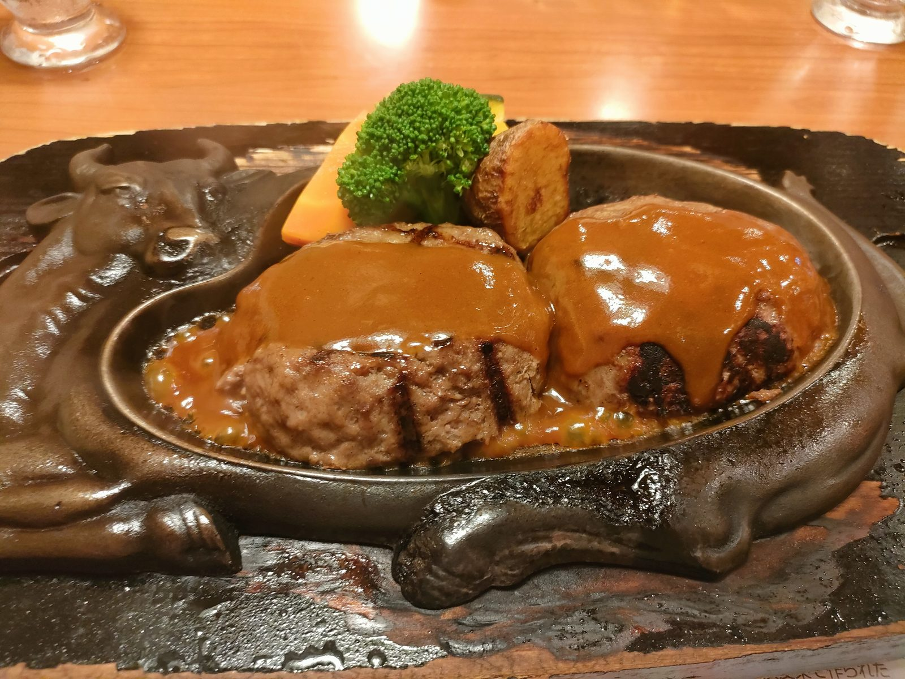

道中一番思い出に残っているのは、浜松周辺にある掛川花鳥園。
園内に信じられないくらいの種類の鳥がいて、もうトリットリしてる感じ。
園内に爆音で響く鳴き声の鳥がいて、あいつは多分他の鳥にもウザがられてると思う。
あと、園内の奥の方にハシビロコウがいる。

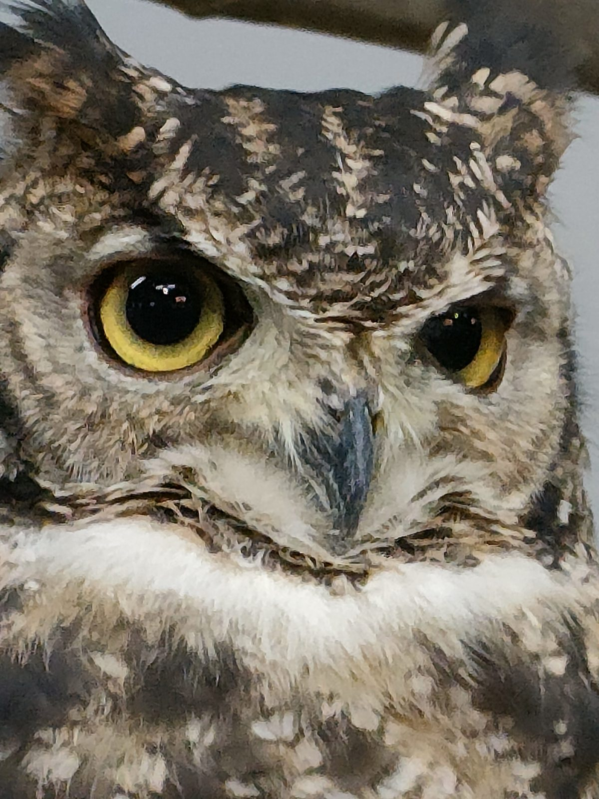

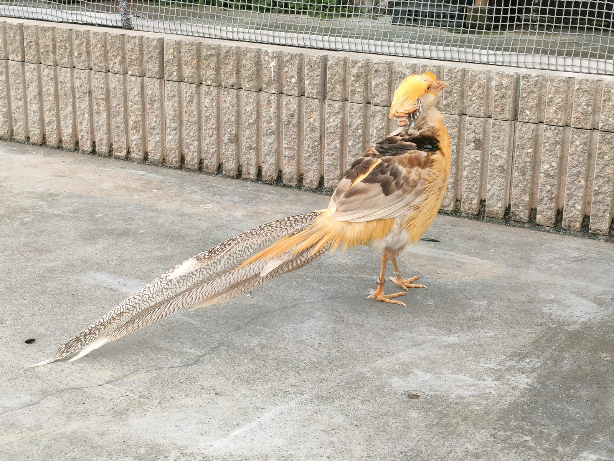

折り返し地点は名古屋市水族館。理由は私が水族館が好きだから。

ゲーミングクラゲ。
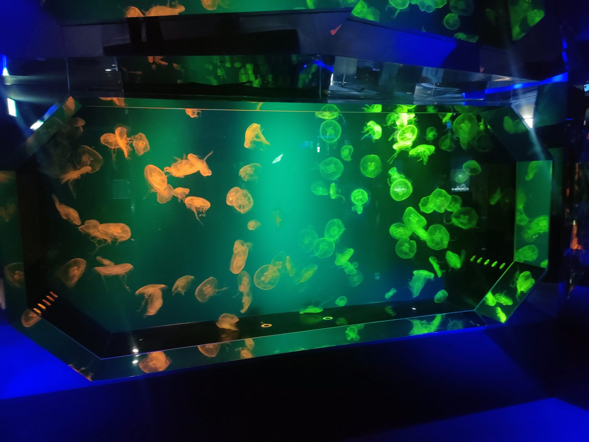

旅の帰路は何もせずに全スルーで帰りました。普通に皮膚の病状が悪化していて、治療の時期全体で見たら一番悪かったんじゃないかな。外に出るなよって話。

かと思えば、その数日後にはTwitterサークルのメンツで葛西臨海水族園に行っていますね。
頭おかしいんか。
金使いすぎだし、体調悪いなら休めよ。
これだから、ハイというのは人間をダメにしますね。

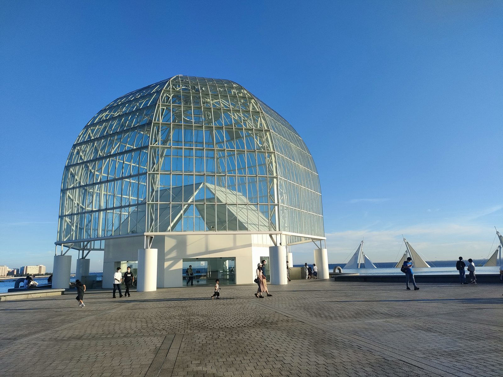

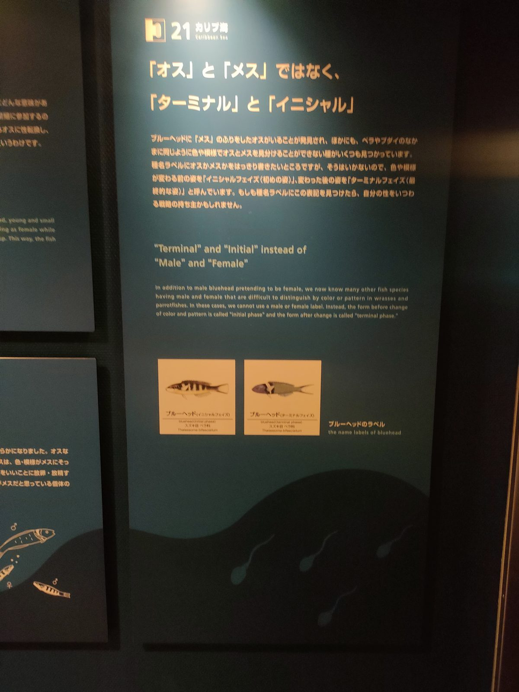

流石に当時の自分も気づいたのか、月の後半はゆっくり過ごしていたっぽいですね。
写真やカレンダーを見ても、特に何もやってなさそうです。

## 2022/10
コロナが結構終了ムードになって来て、イーロンマスクがTwitterを買収しました。
秋学期の授業が始まり、Twitterサークルの皆さんとの対面での遊びとかが増えていきました。

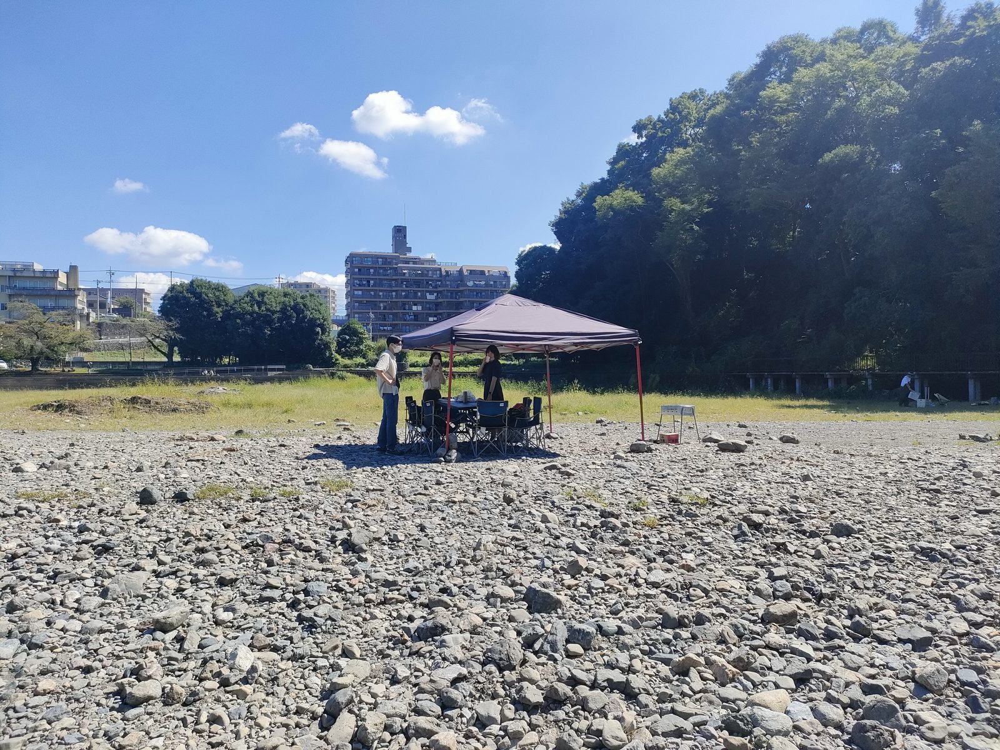

またここら辺の時期から、主な寝床が祖母宅から彼女の家に移行していきます。
居候とか、放浪生活、みたいなのは性に合ってて好きだったので、各所を便利に使わせてもらっていました。

夏の関東の酷暑を経験した私は、授業絶対サンダル出席マンとして転生を果たし、青春18きっぷ大好きサンダルキャラみたいな感じになっていた記憶です。

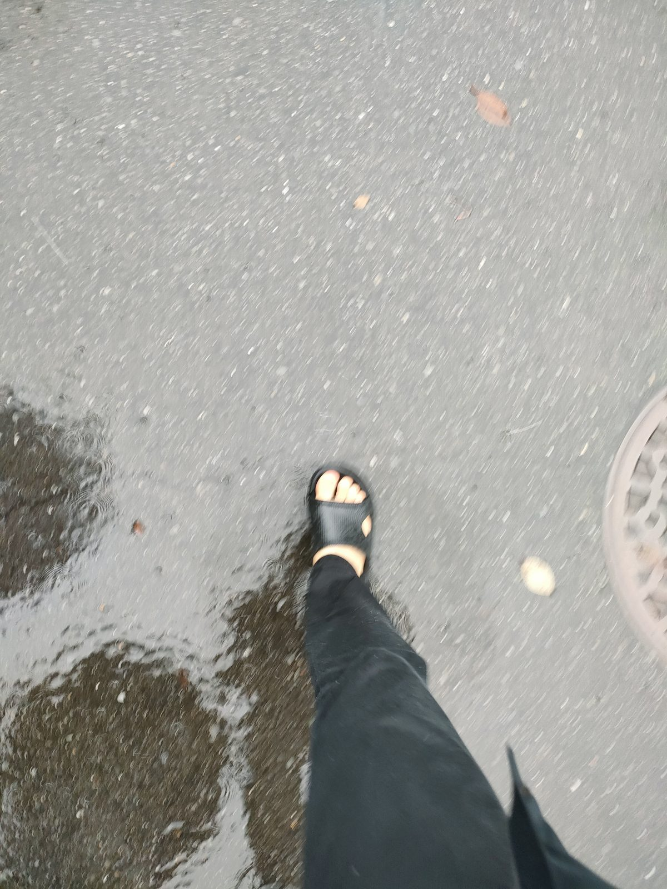

そして、体調も戻りつつあってまた調子に乗った頃、ひとりで訪れたラーメン中本で辛い食べ物人生に幕が降ろされます。

犯人
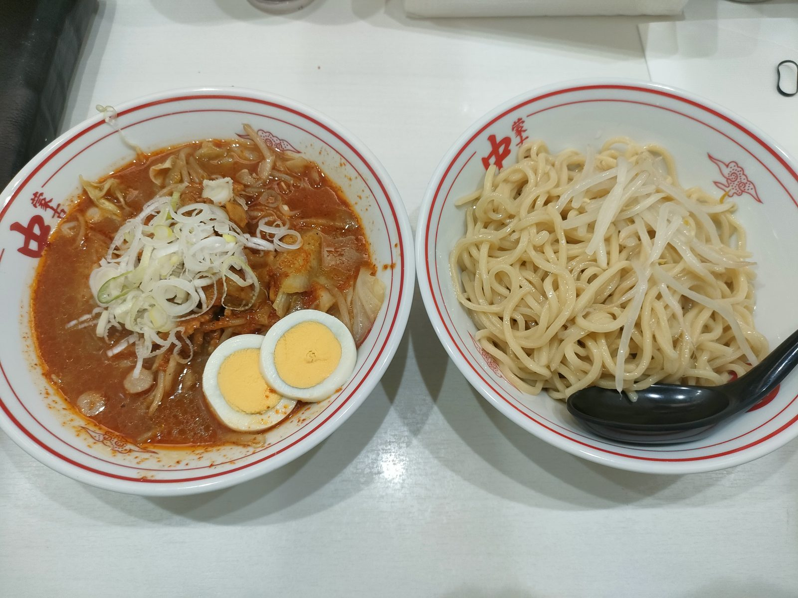

この頃から、自動車免許を通いで取り始めています。
めちゃくちゃケチだったので、授業を省いて実技だけをやってくれるタイプの教習所を探して通い、座学はセルフで詰め込むスタイルでやりました。

なんかのタイミングで、祖母含め親族とご飯を食べるタイミングがあり、うなぎを食べました。
他人金うなぎ。

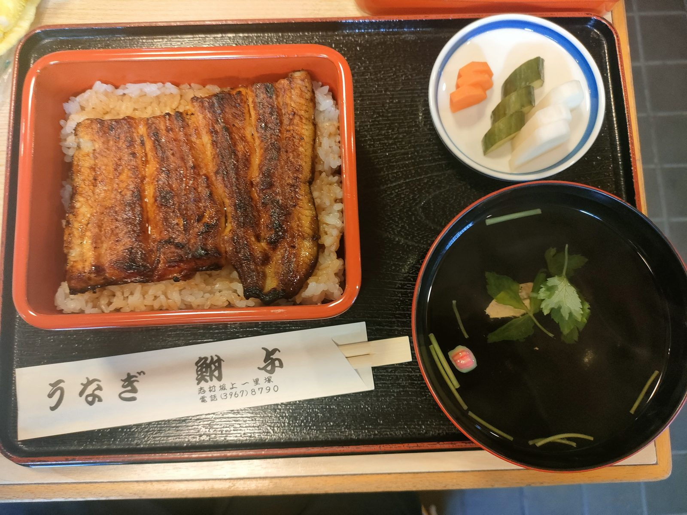

漫画の頃から好きだったチェンソーマンがアニメ放送していた時期で、いろんなグッズ販売がやってたりしたので、ノリで行ってたりもしていました。
アニメはあんまりだったな、。
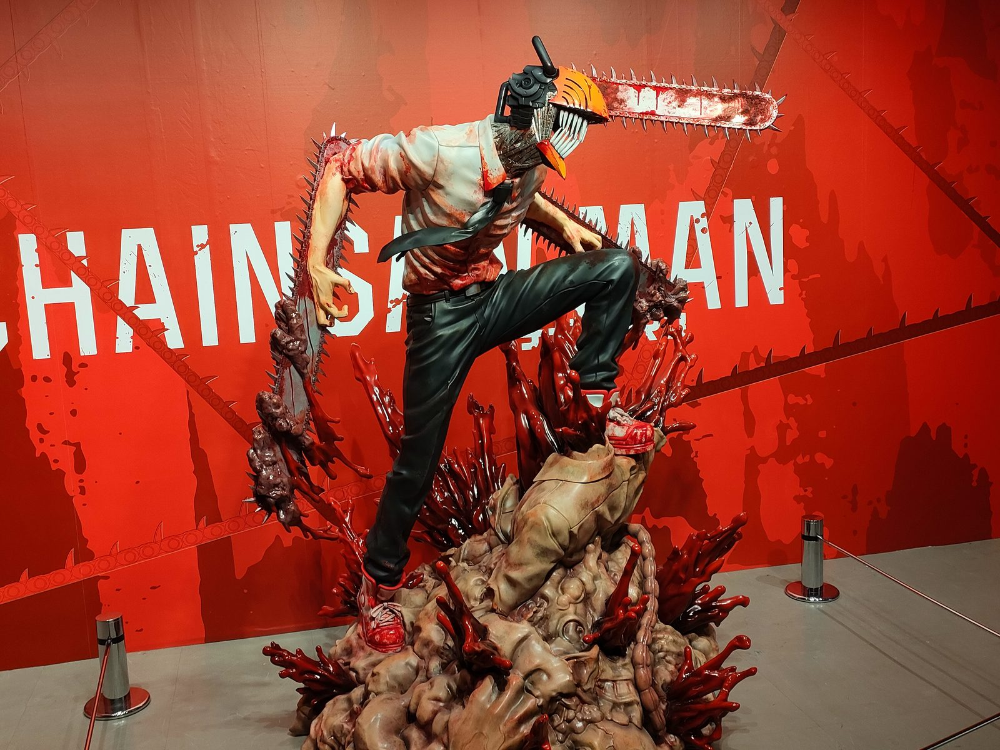

## 2022/11
キンプリがエグい脱退を発生させていたり、ChatGPTは登場したりしました。
キンプリは全然知らないですが、ChatGPTはここから色々世界を変えて行ったと思いますし、私の人生設計にも大きく影響したと思います。
具体で言えば、この後から私は本格的にコンピュータサイエンスの道を勉強し始める(プログラミング勉強したり的なこと)のですが、当時「食いっぱぐれないから」という理由で専攻したこの道を、執筆現在は「食いっぱぐれるから」という理由でメインキャリアとして選ぶのを躊躇したりしています。
大学の授業でも、ChatGPTの使い方についてあれやこれやうるさくなって行ったのを覚えていますが、技術の進歩は止められないし、それはもう大変に便利なのですから仕方のないことです。
その後、大学の残り3年半をかけてLLMエンジニアとしての道を進もうと思い研鑽を重ねるものの、最近はこの先に道はない(あっても新卒が通れる道ではない)のではないかと感じ、2026年4月からは消極的な意見が私の中の大半という状況です。
人間にしかできないことをメインキャリアにするべきなのではないかと思い悩み、再度人生を振り返ってみて考えようということでこの文章を書き始めました。

この時期、理由は覚えていませんが、衝動的に2万円くらいのアクションカメラを購入しています。
衝動買いとは言え、普通にVlogとかに憧れはあったのでその後ぼちぼち使うことになります。
散歩やバイクの様子を撮影するのは現在でも趣味の一つで、別にどこにも出していませんがいそいそと楽しんでいます。
流石に動画がクラウドストレージを食いすぎているので、気が向いたら編集してYoutubeにあげてみようかな。

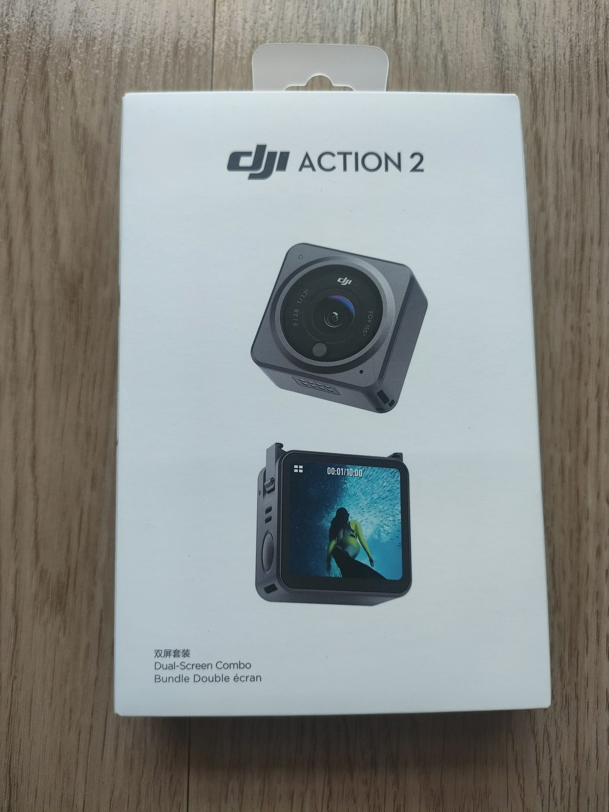

季節もかなり秋になり、森に溢れた所沢キャンパスは通うのが楽しいような風景になっていきました。

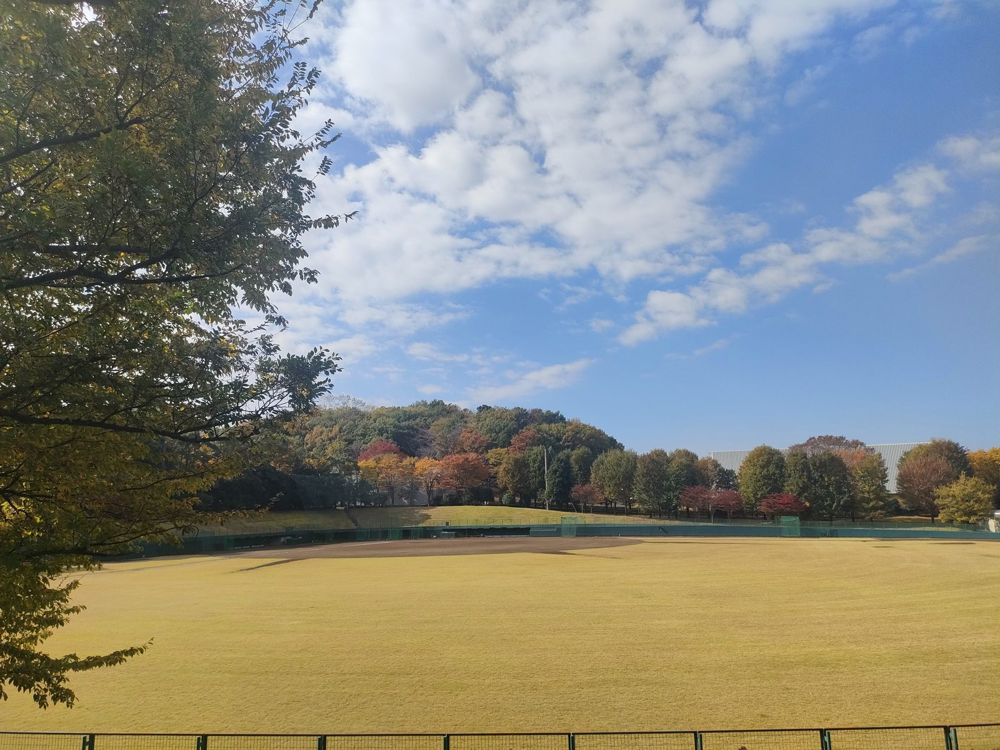

まぁた二郎食ってますね。
どんだけハマったんだよ。

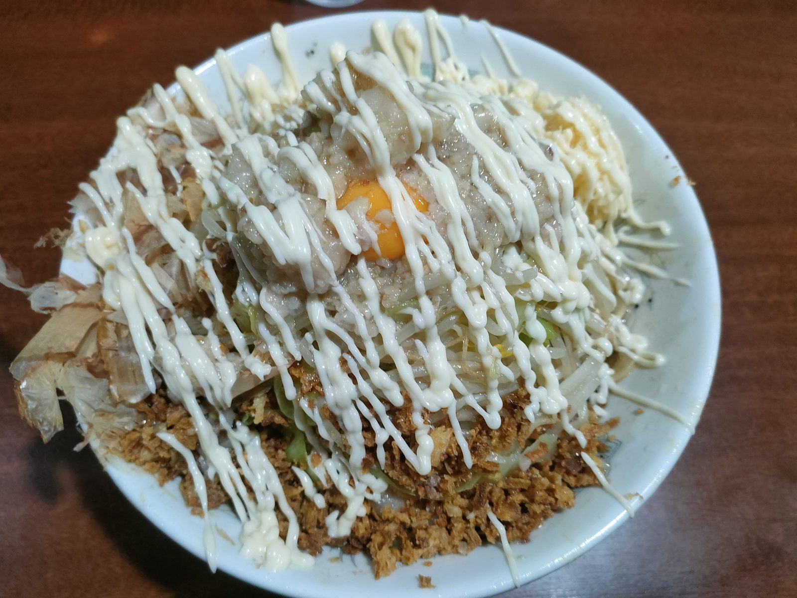

10月末に父親と会った時に、父親の親戚経由で私にプレゼントされた、Youtuberヒカルの書籍をメルカリで売ろうとしています。
わざわざ自分で本買って親戚中に配るくらいなので、だいぶ熱心なファンかと推察されます。

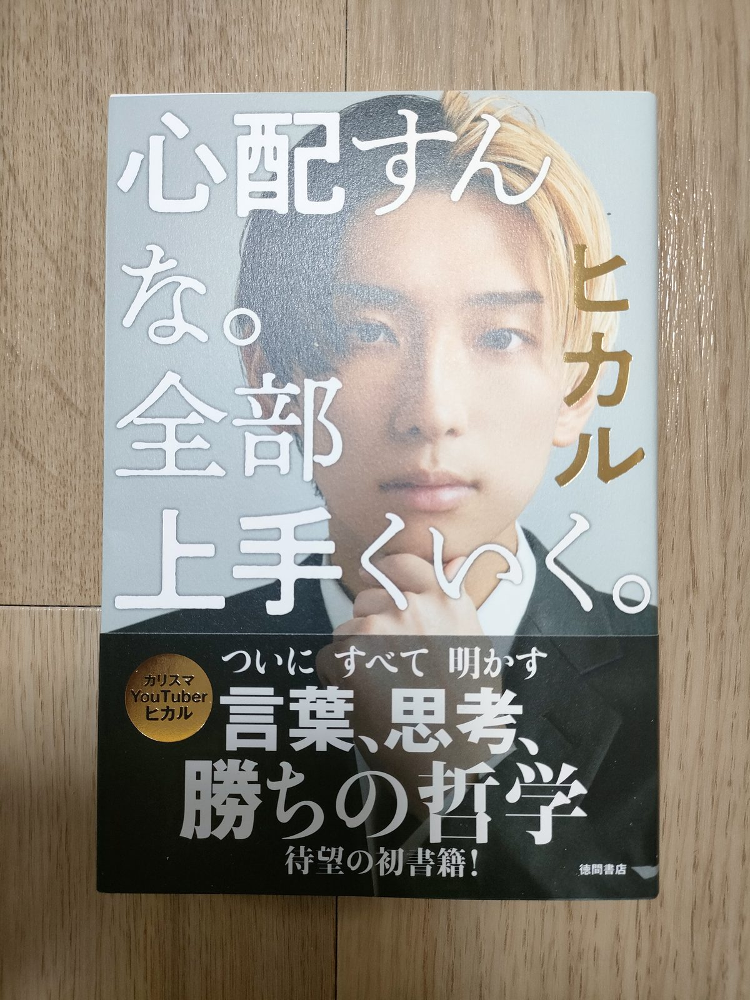

これとは全く関係なく、私は(私の性格が問題で)親族付き合いがめっちゃ苦手で、ほとんど関わりがありません。
私の幼少期を知っているからという理由で、特に愛着もない人から馴れ馴れしくされるのがなんか辛い、と思ってしまいます。
普通に僕の性格が悪いですね。

## 2022/12
新潟で記録的な大雪があり、スラダンの映画が公開されました。
新潟は大雨と大雪で地鳴らしされた1年なのか...と思うと気の毒でしたし、スラダンは読んだことないです。

月の頭からめっちゃ二郎食ってますね。

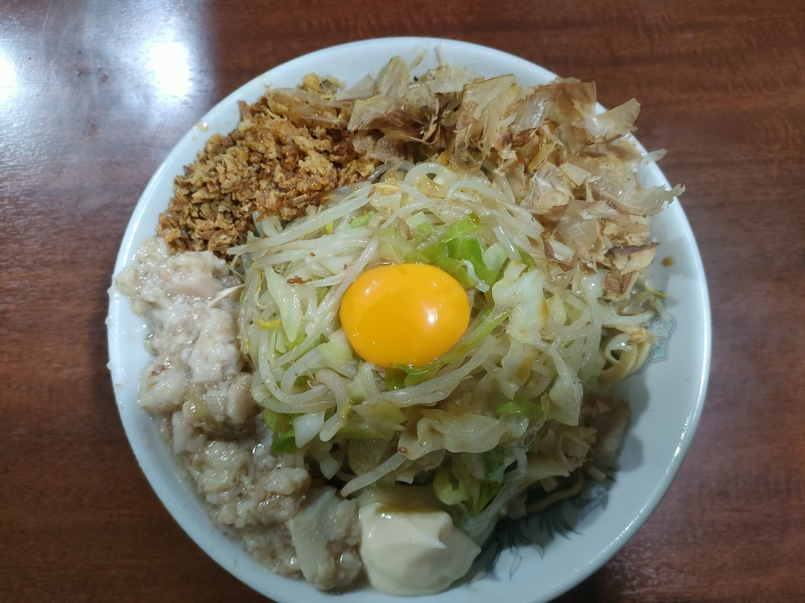

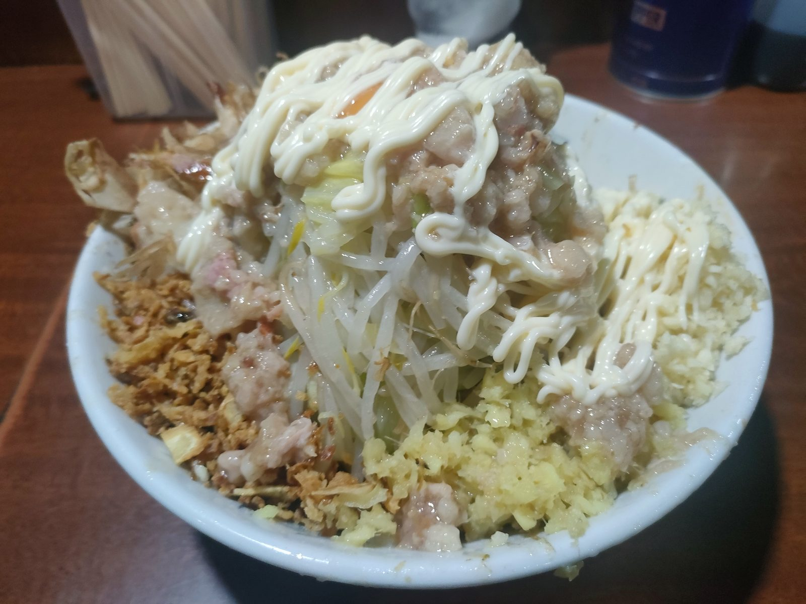

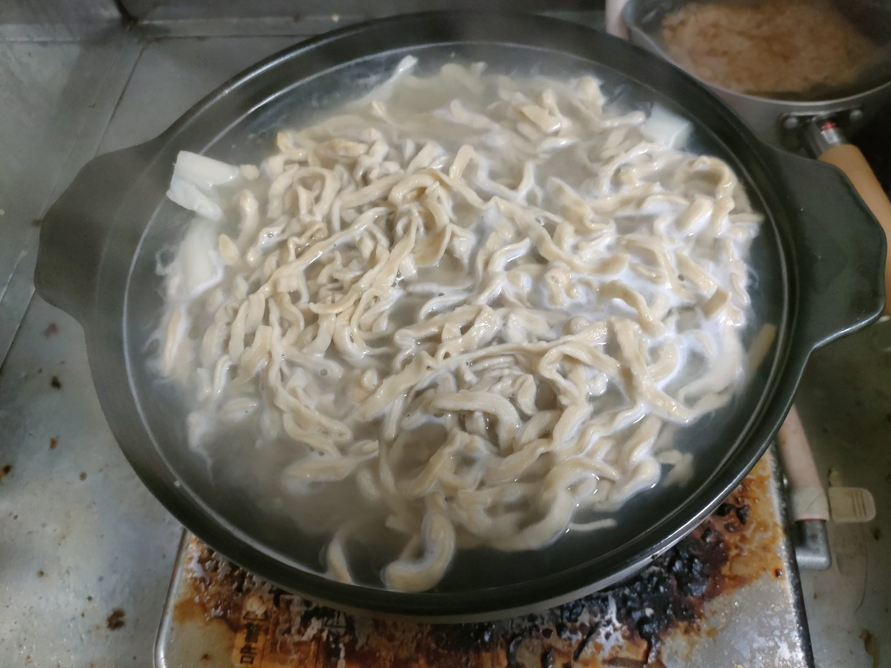

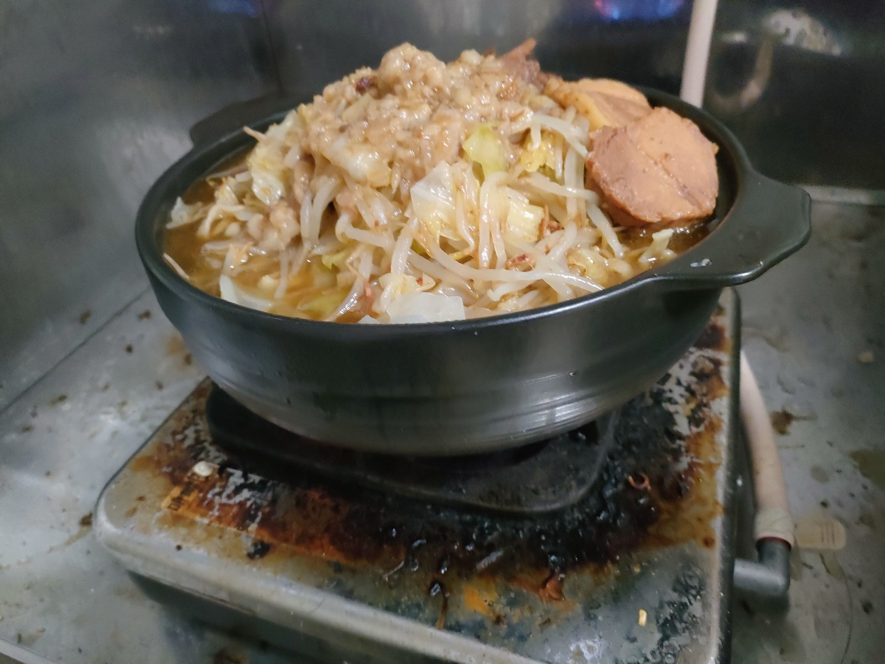

二郎を教えてくれた彼の家で、家二郎パーティが行われ、これの最高具合が界隈を震撼させました。

彼の家での宅飲みは以降何回も行われますが、どれも本当に楽しくいい思い出です。
初回当時はまだ19歳だったので私はアルコールを飲んでいませんが、浪人経験のある友人は飲んでOKの飲み会でしたので、グデングデンになった友人を見ながら、翌年の飲み会をすごく楽しみにしていたのを覚えています。

要加工
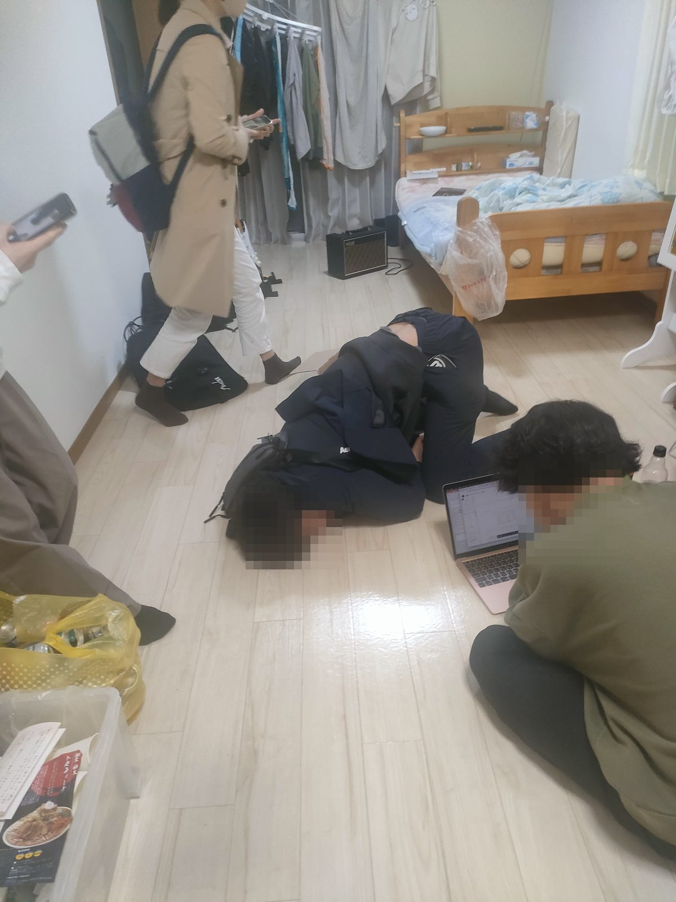

多分この時期が二郎熱のピークで本当に二郎の写真しか残っていません。

一番最高だったのが、まさき(非乳化)の汁なし。
キクラゲのトッピングがあるのですが、ノリで頼んでみたところ尋常じゃない量の黒いひもが...。
死ぬ気で食べましたし、とても美味しく、以降何回か通い詰めることになります。

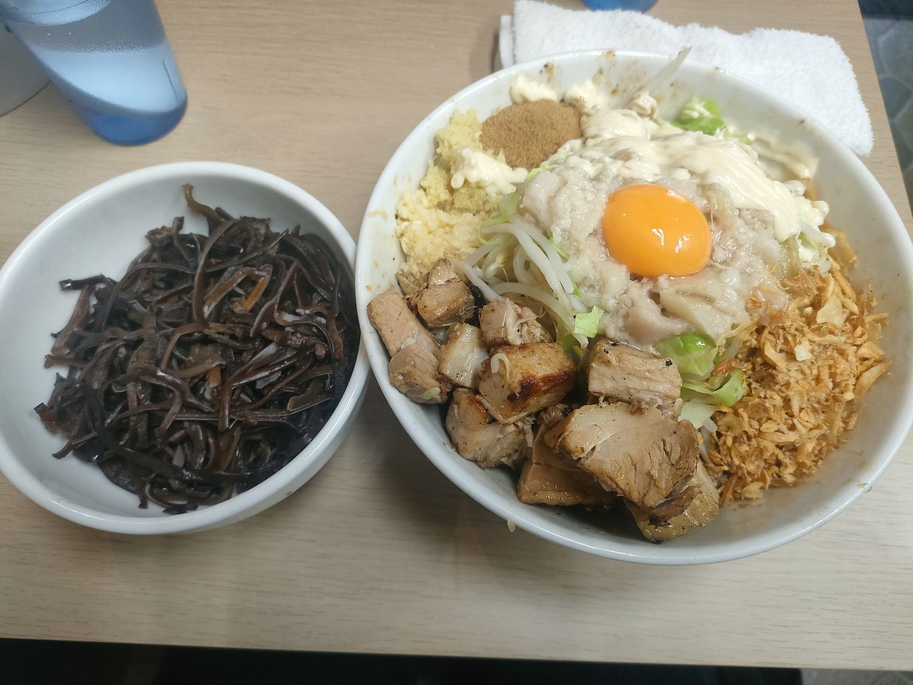

冬休みに入り、各々が帰省していくなか、今回は帰省せず、かなりゆっくりした年末年始を過ごしました。
こたつ養生のおかげか、二郎の栄養のおかげか、夏に患った皮膚の病気もこの頃に治り、以降はほとんどぶり返さなくなりました。
ひとりで居るのが落ち着くんだと思います。

## 2023/01
ルフィ事件をきっかけに闇バイトが社会問題化し始め、ChatGPTの利用が急拡大した時期です。
私もこの頃からChatGPTを使うようになり、すごいすごいとは聞いていたものの最初に触った時の衝撃は今でも覚えています。

静かな年始を過ごした後、サークルのメンツでディズニーに行っています。
このディズニーは、もともと体調もあまり良くなく、年末年始で完全にひとりモードに入っていたので上手く人間関係ハイに戻ることができず、あまりうまくいかなかったのを覚えています。
上手く行かなすぎて、家に帰って泣いたような気もします。

冬休みが明けて授業が再開されたとは言え、授業自体も残り2,3週あるかないか程度。
冬ごもりのひとりモードになったためか、特に面白い写真が何も残っていません。

この頃、こもってTwitterを見ていた時に、42Tokyoというエンジニア養成機関の記事だか広告だかを目にします。
大学入学から1年経とうとしているこの時期に、その1年を振り返り、ほとんど遊んでばかりで何も学びたいことを学べていなかったことに気づき、かなり大きく後悔します。
そんな時期に見つけた「エンジニア養成機関」と「学費無料」の文字に飛びつき、ノリで受験します。
一次試験はwebテストなのですが、とりあえず合格します。
二時試験は長期的なもので、かなり予定を喰うものでしたが、免許の仮免も受かっており、春休みはずらせる予定しか入っていなかったため、翌月2月に二次試験を受けることに決めました。

## 2023/02
ルフィが逮捕され、少年はスシローの醤油をペロペロしました。
醤油ペロは鮮烈でしたね。おでんツンツン以来のムーブメントを感じました。

2月は私が42Tokyoの二次試験Piscineを受験した月です。それ以外は何もしていません。

あ、月の頭に鍋二郎飲み会をしたのを忘れていましたね。
自分は飲まないながらも、お酒は最高なのだ、と再確認しました。

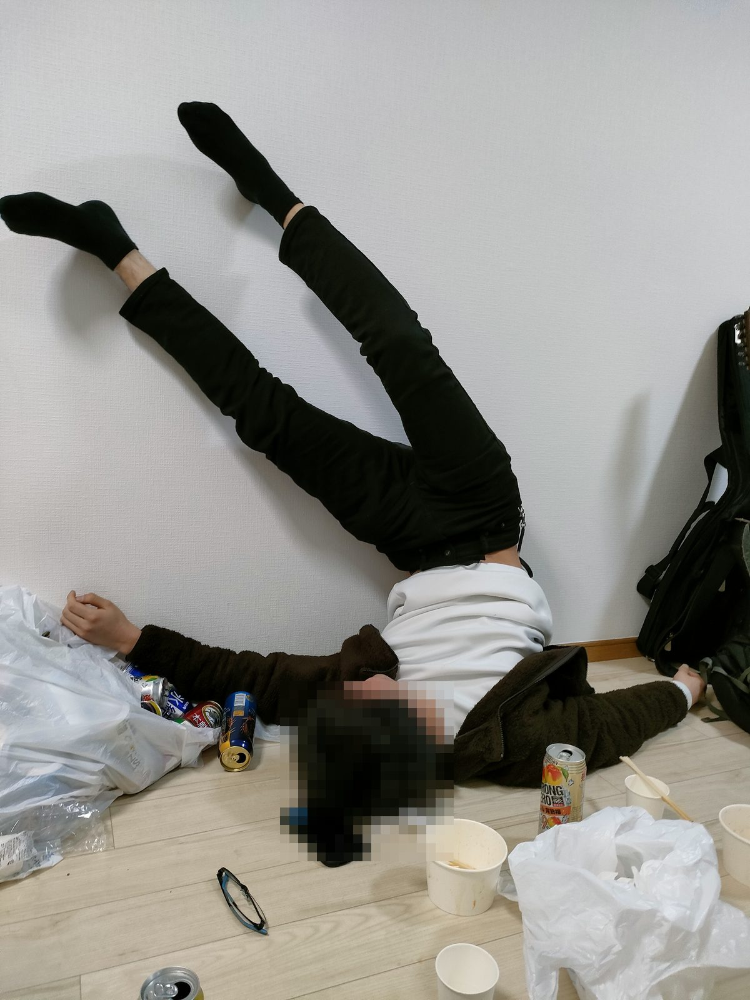

42Tokyoの二次試験Piscineは、4週間かけて行われる過酷?なもので、とにかく毎日校舎に行き、プログラムの問題を解き、帰ります。

課題の内容はかなり初歩的な、というか原始的な?内容から始まるもので、コンピュータ科学をゼロから理解させる42の理念に基づいたものだと考えられます。
試験環境としても特殊で、受験生はただ課題が与えられるのみで、教師は存在しません。
基本的には受験生同士で教えあったり、自分で調べて自己解決したりすることが推奨されており、ChatGPTが出始めの時期で学生の大半は何もわからないものをとにかく調べるだけの時間に苦しんでおり、42が提供する過酷な環境に耐え抜くことが求められているような試験内容でした。

写真についても、他の受験生のプログラムを教え合う中で記録として撮らせてもらった写真ばかりで、試験内容の公開禁止の規則に抵触するため載せられるものがありません。

受験生は高校生から老後の余生として来られている方(失礼かも)までかなり多様で、同じ方向を向いて頑張る方々と濃密な4週間を経てお知り合いになれたことが、後々の人生の大きな財産になっているし、思い出そのものが強烈なものとして残っているなぁとしみじみ思います。

当時の42Tokyo校舎があったのが六本木のビルであったため、夜遅くまで課題に取り組んだ日の、窓から見える東京タワーの夜景がとても綺麗だったのを覚えています。

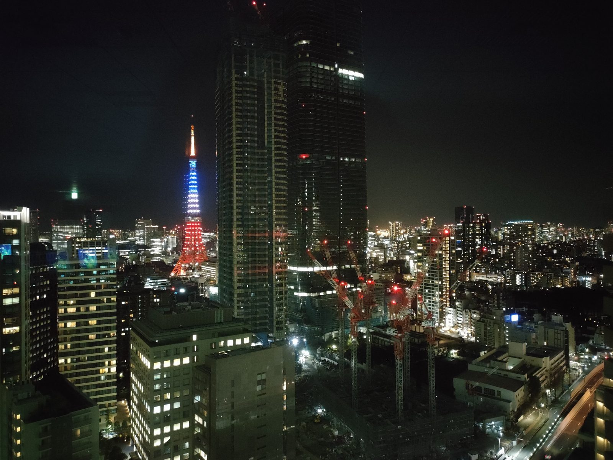

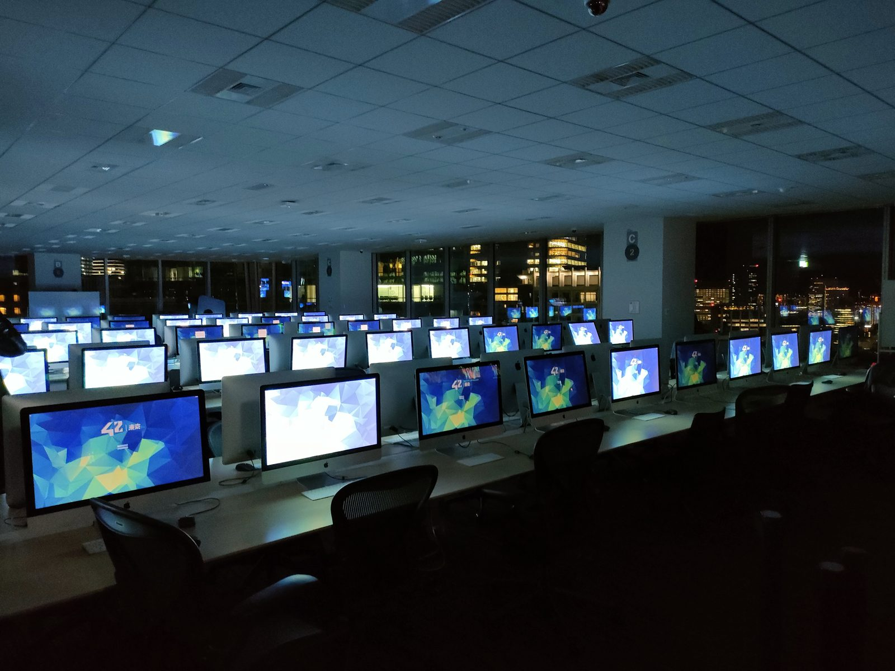

## 2023/03
侍ジャパンがWBC優勝し、マスク着用が個人の判断宣言が出たぐらいの時期です。
こう振り返ると、大学1年生の時はみんなマスクだったのかぁ、とびっくりです。
2年生が始まってからもマスクの方はぼちぼち居ましたが、私は速攻でマスク捨てました。
あと野球は全然興味ないです。ヌートバーしか覚えてない。

2月にとても頑張ったので、3月は休もうという感じでした。
とはいえ、仮免で放置した自動車免許があるので、ぼちぼち路上練習を入れる必要があります。
ケチって座学がない変な自動車学校に行っていたため、春休み大学生免許シーズンであるにもかかわらず、結構なペースで路上練習を入れられました。
ちなみに、座学がない自動車学校＝免許センターでの一発試験のための補助学校　という感じなので、自動車学校での路上教習の先は、自動車学校でのテストではなく、府中免許センターでのガチ警察の人との密室ドライブデートをこなさないと合格にはなりません。
教官の方の態度がコワモテな感じなの、どうにかならないんですかね？緊張してしまいます。
おかげで本免で1回落ちました。

月の終わりにはなんとか合格し、これで免許ホルダーです。合格の日は満開の桜で、帰り道が誇らしかったのを覚えています。


この時期から、東京の街を夜散歩するという趣味が本格的になっていきます。
1年間頑張って人間関係ハイをやってみはしたものの、結局ひとりが好きという本質は変えられません。


42Tokyoの合格発表は月の中旬だったかと思います。
合格発表の日までは本当に気が気でなくて、だから本免も1回落ちたんです。
合格発表の直後は、受験中に仲良くなった友人とすぐ連絡を取ったり、電話したりしました。
本当に嬉しくて、こっから自分のキャリアを築いてくぞ！！！って感じだったと思います。

この頃から就活に対する意識を強めていて、オンラインの就活の説明会？勉強会？で、スライド画面をスクショしている画像がいくつか残っていました。

## 2023/04
ジャニー喜多川が問題になって、コナン映画のサブマリンが公開されました。
全然どっちも興味なかったです。

2年生の授業が始まります。
学部の制度上、2年生になると取れる授業の幅が増え、より専門的な内容の科目を取れるようになりました。
42Tokyoにも入って、エンジニアとしてキャリアを進める気満々だった当時の私は、「情報数理学」とか、「人間情報計測モデリング」？みたいなタイトルの科目をじゃんじゃん履修し、とても楽しんでいた記憶があります。
情報量とかエントロピーとか、うっすら覚えてます。


月の後半に、彼女と横浜中華街に行っていますね。


あと、サンダルを履いている足を写した写真が尋常じゃないくらいの量残っています。
サンダルキャラだったんですね。
しかもドンキで買った死ぬほど安っぽいやつです。貧乏キャラだったんですかね。しゃばい。


## 2023/05
ゼルダのティアキンが発売されます。
ゼルダのティアキンにはたくさんの時間を溶かさせていただきました。全クリしてないです。

車の免許を取ったからかなんかの理由で、キャンパスの近くにある三井アウトレットパークまで遊びに行った時に、敷地に泊まっていたクレープ屋台のデコレーションの文字が、「ももちゃんクレープ」ではなく、「ももちゃクレープん」だったのが、自分の中で向こう半年くらい面白くて流行ります。
ももちゃクレープ'nて。rock'n rollじゃないんだから。
店主はコワモテなスキンヘッドのおっさんで、rockを感じました。クレープ作るの下手でした。


月の中旬に、42Tokyoの入学式がありました。
すでに在籍していた学生の方から、入学試験よりも難しい課題があることは教えてもらっていたので適度にビビりつつも、結構ワクワク。


この時期だったかは覚えてないですが、親しい友人の男性女性1人ずつと一緒に、銭湯まで歩いて行って、帰りもしこたま歩いて鉄板焼き屋に行くというイベントが発生したような気がしています。
結果的に、このメンツはその後色々とお世話になったので、後から考えればとても思い出深い出来事でした。
そのイベントに紐づくお好み焼きの写真かどうか、微妙なところですが、お好み焼きです。


## 2023/06 
藤井聡太が七冠を達成し、Apple Vision Proが発売されました。
将棋はマジで知らんです。Apple Vision Proは欲しいです。

1日に高熱出してる写真がありました。
翌日の日付で、コロナ陽性の証明書の写真がありました。
ここで初めてのコロナ罹患だったと思います。
いい感じにキツくて、初コロナちょっと嬉しかったような気がします。


ちょうど涼しいぐらいの季節になって、飯能のムーミンバレーパークに行きました。
彼女と行っていますね。
生来のひきこもりにしては、定期的に彼女デートイベントをこなしています。えらいですね。


なんの広告の文脈だったかは忘れましたが、クールポコの仙庭さんの高画質画像が公開されました。
これがめっちゃ嬉しかったです。
こんなに綺麗な「な〜」と「に〜」をスマホに入れておけるのは、この時代に生まれた人間の特権だと思います。


早稲田大学の所沢キャンパスには、空飛ぶペガサスの像があります。
よく見たら、ペガサスがめっちゃプリケツです。


コメダの入り口の引き戸説明のフォントは、ホラー風味です。
たまにあるこのフォント、レトロでおしゃれな感じと、ホラーな感じの両方に使われているの、結構ミスじゃないですか？
どっちかが譲った方がいいと思います。


月の半ばに、4年くらい伸ばした髪を一気に切りました。
もちろんケチなんで、普通のハサミで、セルフでいきました。
40cmくらい一気にいきましたので、切り離した髪の毛についてはヘアドネーションさせていただきました。

ヘアドネーションですが、人毛でかつらを作って、小児がんの子供とかに渡すらしいです。
元々髪型に興味がなかったために思いつきで伸ばし始めたこのロン毛。高校の時は変なやつみたいな認定受けてたような気がするし、中学の友達は触れづらそうにしてたような気もするけど、どこかのガキを笑顔にできているなら、これ以上の幸せはありません。

髪の毛は輪ゴムで束にして、zip lockに入れて、レターパックに入れて所定の住所に送る感じで、案外あっさりドネーションできちゃいました。
これが、レターパックで髪の毛送れ　詐欺です。
髪の毛詐欺られた！


キャンパスでたまたま見つけた、振袖のパンフレット。
に映るのこモデルの女性の方、めっちゃタイプです。
名前調べたけどわからなかったです。教えて。


## 2023/07
ビッグモーターが草を枯らし、TwitterがXになりました。
草生えますね。

基本的にはただ淡々と授業を受けています。
面白かった授業の場面として、自分で筋電計を作る、というものがありました。
電極を自分の腕につけ、いい感じに回路を組んで、PCのボイスアプリに接続します。すると波形が見れると。
生体実験にはそんなに興味がなかったのですが、こればかりはちょっと興奮しました。


また、月の頭に、彼女と付き合って一周年を祝うケーキを食べてますね。
世のカップルはこーゆうことをしているのか、と思いました。偉いなぁ。


多分ここら辺で、同級生でエンジニア系志向の女性の方から、LINEが届きます。
内容は、情報系のサークルを一緒に作らないか？という誘いです。
軽い提案のような文面だったような気もしますし、アツい打診だったような気もします。

1ヶ月ほど前にお好み焼きを食べた時になんとなく、こんなサークルあったらいいよね的な話題があり、それを実現させようという流れです。

LINEをいただいた正確な日付は忘れました(LINE履歴が消えてしまいました)が、少なくとも夏休みの間にはサークル設立のための下調べが進んでいったことがわかる記録が残っていました。

このタイミングで、お好み焼きを食べたもう1人の男性の友人にも話を回し、それからは手厚く手伝ってもらいました。

以降、サークル創設と拡大に対して、かなりの時間資本を投下していくことになります。しゃばい俯瞰をして言うのであれば、これが"学生時代に力を入れたこと"、ガクチカだ！と、胸を張って言えます。言えますし、もっとちゃんと人生レベルでこの事象に向き合うのであれば、自分の学生時代が意味のあるものだったかもしれない、と思えるような。周囲のコミュニティに対して還元できたかもしれない、と思えるような。とても大切な出来事でした。

軽い気持ちだったか、アツい気持ちだったかはわからないけれど、LINEをくれて、友人女性にはとても感謝しています。ありがとう。

8月だけど、サークルのSNSを更新し始めた記録


## 2023/08
慶應義塾高校が夏の甲子園で107年ぶり優勝し、ドラマ『VIVANT』が流行りました。
野球は興味ないし、阿部寛はﾍﾞｯﾊﾟﾝ!?って何回言うねんって思いました。ドラムかわいい。

8月は夏休みです。
流石に昨年の帰省で青春18きっぷには懲りています。19歳になったし。
この年の帰省は、飛行機にしました。
とは言ってもケチはケチなので、最安のチケットである早朝便に乗るため、人生で初めての空港泊を敢行します。
成田空港の第三ターミナル。コンセントのあるベンチを占領します。
かなり眠いけど、ちょうどいい感じに寝かせてはくれないゴワゴワベンチのおかげで、早朝の松屋が身に沁みました。


うん。やっぱり地元の風景が一番きれい。


高校への登下校で使っていた路線の電車が、なんかめっちゃ近未来な感じの車体になっていて、ちょっと悲しかったのを覚えています。


この帰省では、多分本当に何もせずに帰りました。飯の写真しかないですね。

この月、裏では彼女が1ヶ月まるまる海外留学に行っていました。
私はその分、42Tokyoの課題を進めていたと思います。
42Tokyoの課題の中で、結構大変とされる `minishell` というものがあります。
この時期には `minishell` より前の課題が終わっていて、ここから3,4ヶ月 `minishell` に苦しんだと思います。


居候していた彼女の家で、ひとり、20歳になります。
## 2023/09
実写版の『ONE PIECE』が公開され、iPhoneがUSB-Cになりました。
ワンピースは完結するまで読まないって決めてます。iPhone使ってる人は金持ち。

Twitterサークルの方で合宿がありました。
メンツの中に高いカメラを持っている方がいて、めっちゃ写りのいい写真がたくさん共有されているので、ここだけカメラフォルダの厚みがすごいです。
カメラっていい趣味だなぁ。
この時期は人間関係オフモードだったので、今思うと、もっと上手く会話できたなぁ〜みたいなうっすら後悔があります。

晴れて20歳、成人になったなぁ、と思うかと思っていたのですが、19歳の時に成人が18歳に引き下がったので、成人になったというよりかは、成人を追い越していました。

国民年金の書類が来て憂鬱だったので、東京の夜景を見せてあげました。


## 2023/10
藤井聡太が八冠になり、全銀ネットが障害を起こし、ジャニーズがスマイルアップになりました。
僕なんてまだ0冠なのに...。
ジャニーズが亡くなってどうなるかと思ったら、M!LK？とか、いろんな事務所のアイドルがどんどん出てきましたね。需要が全てを作り出していきます。

友人女性と設立した情報系サークルの活動が徐々に本格的になっていきます。
いろいろ話し合った結果、部室が欲しいよねということになり、そのためには大学の公認サークルになる必要がありました。
公認サークルになるためには、実績が必要でした。

活動の一歩目として、とりあえずどこでもいいから集まって、プログラミングを勉強する空間/コミュニティを作っていこう。活動の毎にレンタルスペースを借りるのは現実的ではなく、自然とカフェが集合場所になっていきました。
記憶の中でも、初回のサークル説明会をするためのレンタルスペースを借り、とにかくいろんな友人に初回説明会の情報を口コミしてくれ！！って言い回ったのを鮮明に覚えています。


Twitterで会話するだけのコミュニティに入っていたおかげで、自分と友人女性のアカウントでアナウンスするだけで、何人かのメンツが集まりました。これに私たちの友人数名が加わり、7,8名の初期メンバーになります。

彼女の誕生日に合わせて、バカ高いモンブランを食べにいきました。
朝から並ぶんですよこれ。
めっちゃ美味しかったです。


秋学期の授業が始まり、学部の制度上、3年生からのゼミを選ぶ活動が始まります。
1年生の時のサークル新歓に参加しまくったように、こーゆう時の情報戦には一切の妥協なく全力で挑むタイプです。
42Tokyoの学生になって以来、エンジニアとしてのキャリアを極めるんだ！！って感じだったので、情報系のことができる研究室という条件で探しました。そこまで重要視していなかったですが追加条件で、LLMを触れることも考えていました。結局はその両方が叶う研究室に入ることが決まります。
結構アツい面談をしたのに第二志望にしてしまった松居先生にはなんか申し訳なく思っていますし、勝手にですが全然気まずいです。


山梨に紅葉を見にいこう！ということで、予定のあったメンツで車を出します。
ほうとうを食って、紅葉を見て、ほったらかし温泉に行きます。
私だけちょっと体調が悪く、温泉には入らなかったため、若干場が白けました。ごめん。


月末に、情報系サークルの方の周回場所として、大学の図書館の一室が使えそうなことに気づきます。
ここがめっちゃ穴場で、喋ってもいい会議室だし、ホワイトボードあるし、空調めっちゃ効いてるし。
カフェ集合の金もケチるようになったらおしまいです。まぁ普通に迷惑だったか、カフェ。


## 2023/11
阪神が38年ぶり日本一になり、OpenAIのアルトマン解任復帰騒動がありました。
野球はマジで興味ないです。OpenAI騒動のスピード感はなんかすごかったですね。

月の頭は、とにかく数日おきに情報系サークルの勉強会を開催します。基本ただ集まってそれぞれやることやるだけですが、その場に幹事長が居ないわけには行かないので、とにかく日常を全部これに注いでいた時期です。というより、これから1年くらいはほとんどサークルに時間を注ぎ込みます。

月の真ん中あたりで父親が東京に顔を出した際に、バカ高いうなぎを奢ってくれます。


全然貧乏家庭の認識だったので、会計で2万だか4万だかの数字をチラ見したときはめっちゃドン引きしました。
でも、息子の上京を祝ってくれているのか、息子と2人きりの状況でカッコつけてくれているのか。父親の姿はとても嬉しく感じました。
それ以降、父親が東京に来るたびに、割といい額のお小遣いと一緒に高いご飯に連れて行ってくれましたが、たとえ見栄のカッコ付けだとしても、生涯残るいい思い出をくれたことにとても感謝しています。

図書館の会議室スペースを使ったもくもく勉強会に、徐々に人が集まるようになってきます。
もちろん波はありましたが、サークル設立以前の友達も参加してくれたりして、活動を盛り上げるのを手伝ってくれていました。


この時期は日常生活の写真がほとんどなく、サークル活動のSNS用の写真しか残っていません。

唯一残っていたのが、上手く作れたふかし芋でした。
上手くふかせたので、陽の光を見せています。


## 2023/12
松本人志が文春砲に吹き飛び、M-1で令和ロマンが優勝しました。
松本、動きました。令和ロマンは以前から見ていてネタが好きだったので、めっちゃ興奮したのを覚えています。

月の頭に、第一志望の研究室からの合格メールが届きました。
結局、この研究室を通して出会ったいろんな方と仲良くさせていただくことになり、学術的な場としてももちろん、いろんな皆さまと繋がれるいいコミュニティに入れたなぁ。と、楽しく振り返れています。今後とも皆さんと仲良くしていきたい。

この時期に、地元の自治体から成人式の案内が届きました。
成人が変わったことで、「成人式」ではなく、「二十歳のつどい」になっていて笑いました。

秋学期から始めたTA(ティーチングアシスタント)、つまり、授業のお手伝いさんバイトで出会った方々が面白い方で、バイトが楽しかった記憶があります。穏やかで気の優しい先輩とTwitterを繋がってみたところ、めっちゃ下ネタ言ってて笑いました。

研究室の合格メールに、「4月までの間の自己研鑽として、資格取得とかおすすめですよ」的な内容があり、真面目だったので何か受けようかなということで、G検定の勉強を始めます。
本当は基本情報技術者とかを取るべきなところ、私の悪い逆張り癖が出てしまい、G検定を選択します。

そして、1年生の時の授業のグループワークでLINEを持っていただけの先輩から、臭いLINEが届きます。
こーゆうの、嬉しくなっちゃいます。いくらバックもらってるんですか？


42Tokyoについて、上述した `minishell` という課題が、月の半ばでやっとの思いで終了します。ペアで取り組む課題なのですが、最初に組んだ人がギブアップしてしまった後、2人目として組むことになったペア相手が女性DJの方で、(結局そんなにガッツリ仲良くはならなかったですが、)その後、色々活動している姿を遠巻きに楽しませていただいています。二郎を教えてくれたバンドマン？の彼も、ペア組んだ女性DJも、東京にはいろんな人がいます。こーゆー方と会った時、上京してよかったと本当に思います。

年末に実家に帰省するのですが、その直前、ふと鏡を見たときに、R指定すぎるな、と思って撮った写真が残っていました。
今見たらまぁわかるけど、そんなにR指定でもないよ。
私はDJ松永と同じ誕生日です。


実家


お酒を飲める年齢になったら、直後の長期休業期間で実家に帰ろうとは思っていました。
酒をあんまり飲んでなかった両親が、ぼちぼち晩酌をするようになったらしいとは聞いていましたが、本当にお酒飲んでる姿のイメージがなかったので、初めて食卓にビールが並んだのが新鮮でした。
そして、実家のビーフシチューが一番美味しいです。


## 2024/01
能登地震があり、羽田空港で航空機がぶつかり、桐島聡が名乗り出た後に死亡しました。
世界の終わりみたいな年のはじめで、すごい雰囲気だったのを覚えています。

6日に中学の成人式があり、7日に高校の同窓会がありました。
中学はとても小さい学校だったので、集まった全員の顔がわかるし、みんなかっこよくなったり美しくなったりしててすごいな....と思ったりしてました。働いてる人もいたし、みんな頑張ってるんだなぁ〜と思って、僕が若干自意識が捨てきれてない感じなのを俯瞰して恥ずかしかったです。
Twitterののアカウントがバレてるのを教えてくれた人がいて、これが垢バレだ！と思ってちょっと嬉しかったです。


高校の同窓会については、言っても2年しか経ってなかったので皆変わらず、いつメンみたいな感じの4人と卓を囲み、いい感じに写真を撮って終わりました。今あんまり連絡取れてないので、落ち着いたら連絡してみようかな。

要加工


中学も高校も、上京した友達はほとんどいません。ほとんどの人の付き合いが途切れてしまっているのはとても悲しく思います。自分でも、客観的に地元を捨ててしまっている感あるよなぁと思う時があり、地元愛は特にないですが、地元の友人愛はとてもあるので、旧交を温めたいなぁと思っています。

帰省期間中、実家にまとめてあった手紙だのなんだのを開いてみる機会がありました。外は雪でやることないですしね。その中に、12歳の自分から20歳の自分への手紙がありました。タイムカプセルから出てきたんだっけな？


12歳は、結構いい内容の文章書きますね。振り返り記事を書いている時点の私は20歳ではないですが、何か大きな決断を下すときにはこれを読み返します。
読むたび、12歳の自分が予想した8年後の自分が、かなり的を射ていることに驚かされます。
今の自分は、今から8年後の自分に、こんなに的確に問いかけることができるでしょうか。子供ってすごいです。

帰省中に勉強しようと思っていたG検定のテキストを、一度も開くことなく東京に帰ります。
焦った私は、柄にもなくノートを撮ったりしながら勉強を始めます。


再三ですが、情報系サークルの定期勉強会をする日々です。とにかく、活動実績を積み上げていきます。
この時期から、4月の新歓時期に向けて、サークル運営における諸々の資料準備がとても大変になっていきました。具体的には、公認をもらうための申請の書類と、サークル会費を集めるための銀行口座の作成です。
銀行口座の方がとても大変で、口座が売買されてテロに使われるのを防ぐため、本当に活動実績や会則がちゃんとしているサークルなのかどう、さまざまな資料が求められます。結局、40枚くらいの紙の束をほぼ自力で作成し、その過程で銀行の窓口と大学の学生課窓口をなん度も往復します。
大変だったなぁ。

そして、この時期から本格的に株式投資が好きになります。中学生の時にFXに興味を持っていたものの、さすがに口座が作れず、くすぶっていたこのマーケット趣味。大学1年の時はサークルで遊んでいたし、2年の時は42Tokyoとサークル設立に奔走しており、やっとこの時期になってマーケット熱が再燃します。のちに卒業研究でも株を題材にするほど、しっかり好きになっていきます。
## 2024/02
OpenAIがSoraを発表し、Apple Vision Proが発売されました。
なんか、未来って感じですね。

月の頭に、地元の友達が一瞬だけ東京に来ました。
飲みに行ったのが楽しかったですね。

また、TAのメンツで一度飲みにいきました。サークルや研究室以外にも、ちゃんと知り合いを作れたというのが、結構嬉しい思い出です。


ここで、再度思いっきり髪を切ります。
今回は、別にドネーションとかはせず。興がのったので結構いきました。


月の半ばに、ふと思いつきでバイクの免許をとりたくなります。
きっかけは本当にわからないです。
ふと。
教授がメールに含めていた、「資格試験頑張るといいですよ」って、そーゆー意味じゃないと思う。


最安で取ろうと思い、合宿免許の料金を安い順にソートし、一番上に来たやつを予約しました。
場所は那須高原。

10日間の合宿。ワクワクで送迎バスに乗り、駅から合宿所まで向かいます。
宿舎について荷物を置いたのち、まず、契約書を書くための教室に通されます。周囲は高校生ヤンキーばかり。不穏です。
契約書が配られ、教官が、「引き返すなら今です。今このタイミングで帰る決断をすれば、帰りのバスを出します。」と説明します。不穏です。
わけもわからず流されて書類にサインし、午後には授業が始まります。私は自動車免許を持っていたため座学はないコースですが、実技のための最低限の説明をするための、最小限の座学は組まれます。教室に入ってきた大柄の先生が、信じられないくらいの大声で、怒鳴りながら授業を始めていきます。不穏です。

振り返って思うに、安いから、近くの16歳ヤンキーが一堂に集うヤンキーバイク免許合宿所だったわけです。来る人がヤンキーだから、先生の授業スタイルもヤンキースタイルになっていったのでしょう。

ミスをするとすぐに怒鳴られます。バイクのハンドルに何がついているかも知らない段階から、ウィンカーをつけろと言われて、付け方が分からずあたふたしていると、怒鳴られます。教習車の重量は同じ排気量帯の中でも重めのもので、うまくスタンドが立てられずにいると、怒鳴られます。

あぁなんとストレスフルな環境なことか。これを10日間耐えなければならないのかと絶望します。三日目の夜くらいが一番辛かったです。ちなみに外出禁止。息抜きで散歩でもできたらもっとマシなのに。

最終試験の日は本当に緊張しました。これで合格できなかったら、この最悪の環境に延泊しないといけないのか....と。
## 2024/03
日銀のマイナス金利が解除され、水原一平が賭博しちゃいました...。
金利正常化は嬉しいですが、変動金利で奨学金借りてる身にはきついなぁ、。
イッペー・ミズハーラー！

三月の頭に、地獄のバイク免許合宿から解放されます。


そらこんな顔にもなりますわ。

少しして、研究室の新歓合宿があります。同期9人とはもうすでに顔合わせしていましたが、同期で仲良くなるのは大事なので割と張り切って参加です。
合宿内で、次の春学期の履修を考える時間もあります。いろいろ悩んだ結果、「金融DX」という授業を受けることに決めるのですが、これはとても好きな授業でした。再度本腰を入れて金融市場に向き合いたいなと思えるきっかけにもなりましたし。


そして、いよいよ、バイクを購入です。

基本的には金がないので、予算は30万。
中型で、長旅ツーリング向きなもの。
キャリアをつけることができて、できれば黒色。
 Vstrom250がかっこよくて理想でした。

結果としては、中古のCBR200Xを、込み込みで40万。
黒色のモデルもあるのですが、その場で取り寄せられる中古の在庫は赤色しかなく、まぁ妥協です。
妥協の理由としては、ファーストバイクは絶対立ちゴケしまくるから。
お金貯まったら、Vstrom250を新品で買って、諸々キャリアをカスタマイズしたいです。
あーワクワク。金欲しいなぁ。

とはいえなんだかんだ、結構CBR200Xも愛してきています。


## 2024/04
1ドルが160円になり、頂き女子りりちゃんに懲役9年の判決が下ります。
りりちゃんマニュアル、すごかったですね。りりちゃんは獄中です手記も、あれは文学です。

4月は新歓シーズン。設立した情報系サークルも、初めての新歓シーズンを迎えます。

学生が通る道で声をかけたり


コストコで飯買って、集まって食ったり。


この年の新歓は頑張りました。
結構たくさん入ってくれました。
自分のやるべきことは、部室を獲得し、コミュニティを作り、次の世代に繋ぐこと。
そのために、今回の新歓では人数を獲得していく必要がありました。
SNSもフル活用し、非公認サークルで新歓が制限される中でもいろんなことをやったと思います。
この年の春は、割とちゃんと人間関係ハイのスイッチを入れられたので、いろんな初対面の人とちゃんと会話できたと思います。
結局ヨッ友が増えるだけなんだけどね。そんなもんです。

42Tokyoは、校舎の位置が六本木から新宿中央公園に移ります。
前の校舎の方が、好きだったなぁ...。The TOKYOみたいな景色の方が気分上がります。


## 2024/05
共同親権の民法改正があり、GPT-4oがリリースされました。
離婚とか死別でのシングルファーザー系ほっこり物語、好きがちです。親権が母親側に有利という問題が解決された、的な文脈で話題になっていたのかな？記憶に残っています。
GPT-4oのマルチモーダル性は本当にすごかったですね。LLMはマジでAGIじゃんってなりました。

研究室の活動が始まり、学術の世界に触れ始めます。論文読んだり。
研究室の人と仲良くなれるイベントもぼちぼちあり、5月にはソフトボール大会がありました。なんかソフトボール大会にアツい謎の先輩がいて、なんか上手くいって、準優勝賞金がもらえました。その後の飲みで消しとばしますが。


「ななすけの散歩録」というYoutubeチャンネルのファンなのですが、ステッカーを置いてあるカフェがある、という話が動画内で出てきて、わざわざそのためだけに外出して取りにいきました。ちゃんと何かのファンとして推し活的なことをしたのは初めてだったので、結構興奮な出来事だったので、わざわざ写真も撮っています。


42Tokyoでは、ぼちぼちなペースで各種イベントがあり、このタイミングでほぼ初めて、ハッカソンに参加します。
ブロックスというボードゲームをプレイするロジックを作る、ソルバー作成のハッカソンでした。試合形式のハッカソンだったのでわかりやすくて楽しかったですし、受験の世代が違う方と仲良くなれて嬉しかったです。


また、サークルの新歓の延長として、大学野球の早慶戦を観戦しにいきました。結構楽しい試合展開で、何回も早稲田の歌歌ったりして、大学生活を思い返す上で結構思い出に残る場面になったので、行く前は結構渋っていたのですが、結局行ってよかったと思います。

## 2024/06
ニコニコのサイバー攻撃があり、東京都知事選のポスターが話題になりました。
なんか全体的に昔のネットの匂いがしますね。

研究室の活動にもなれてきて、ふと研究室の本棚を見たら、麻雀の何切るがありました。
弊研究室のゼミは、論文を読むのとかは基本的に自己責任で、授業の時間はグループでチーム開発とかを行うスタイルだったので、入って2ヶ月で、非エンジニアに設計を説明したりしていますね。メモが出てきました。


## 2024/07
新紙幣が発行され、石丸構文が流行りました。
3dホログラムのある紙幣って何。論語と算盤読んでみたいなぁ。
冷笑系、冷笑系、アーミノ式

7月から、情報系サークルが正式に大学公認になり、部室がもらえる運びになりました。
空調がちゃんと効いて、机と椅子があって、自由に使っていい空間。
大学生が空きコマに時間を潰すのにうってつけの、素晴らしい空間です。情報系のサークルなので、私物の技術書を寄付し、　サークル図書館を作ったり。ホワイトボードシートを購入し、壁に貼り付けたり。カスタマイズの時間が楽しかったです。
逆にいえば、部室をゲットするところまでが幹事長としての私の責務だと考えていたので、ここからは徐々にサークルに対するやる気がなくなっていきます。もう1年幹事長を続けはしたものの、幹事長役職を引き渡せるようなアクティブな会員が2年生に少なかったため、という消極的な理由だったので、私自身のモチベもあまりなく、ダラダラと活動することになっていまします。これは申し訳なかったし、もったいなかったなぁと思います。


研究室での活動を重ねるたび、自分の卒業研究についてテーマ決めをしないといけない圧力が強まっていきます。自分の趣味はなんだろう、かっこいい研究テーマなんかないかな、といろいろ考え、株式相場とLLMを掛け合わせたテーマを選択することに決めます。
この時期から、エンジニアとしてのキャリア以外にも、金融の世界にも興味を持ち始め、いくつかのオンラインコミュニティに参加したりなどして、さらに株の世界が好きになっていきます。
ただ、後から考えると、趣味であった株を仕事(研究)のテーマに選んでしまったのは失敗だったなぁと振り返っています。

この年の夏から、髭脱毛を始めます。ずっとやりたいとは思っていましたが、未成年から脱毛を始めても、脱毛し終わった後からじゃんじゃん新しい毛が生えるかなーとか思い躊躇していましたが、ついに始めます。
これが本当に痛い。本当に尋常じゃなく。
元々顔中に毛が生えてる感じだったので、髭剃るのもめっちゃ大変でしたし、髭剃りのダメージで肌荒れするのも懲り懲りだったので、痛みを覚悟で決断はしたものの、本当に辛かったです。

古くは中学生の時から髭が生え始め、生え始めた瞬間、周囲で髭が生えている人は誰もいませんでした。生え始めた瞬間から、将来は絶対脱毛してやろうと思い、すぐに電動のシェーバーを買いました。かなり高性能で高いシェーバーを買いましたが、大人になって脱毛するまでもたせるつもりで、投資のつもりで買いました。
高校の時は、もう諦めて顎髭口髭を伸ばして登校したら、先生に若干腐されました。ひげ....いいですね....。みたいな感じで。

という来歴があったので、ついに脱毛だったので嬉しいイベントだったはずでしたが、本当に痛い。
過去にあった髭ネガティブイベントのどんなことよりも、脱毛の痛みが辛く、髭が濃く生まれてしまったことを本当に後悔しました。

結局、合計10回ほど通いますが、まだ髭はちょっと残ってます。は？10万かけてんのに無くならない髭って何。10万て。プチ整形じゃん。
## 2024/08
令和の米騒動があり、フワちゃんが誤爆炎上します。
米は実家にワンコールで送ってくれるので、困ったことないです。ほんまありがとう。
フワちゃんは女子プロ頑張って。

月の頭に、研究室のイベントとして、大学のオープンキャンパスで高校生向けの展示を行いました。
弊研究室の次の年代で入室する学生の方が来てくれたり、高校生側が一切喋らずに親側がグイグイな感じの、モンペが来てくれたりしました。
モンペはことごとくモラハラな感じの対話スタイルで、すげぇなって感じでした。


上京祝いに親がくれた財布がボロボロになっていまい、申し訳ないけれど捨てさせてもらうことにしました。
次に選んだのは、マネークリップ付きカードケース。
これがとっても良くて、以降、極小財布が好きになっていきます。
このカードケースと、コインケースを二つポケットに入れて持ち歩くスタイルが最高で、手ぶらで外に行けるのが本当にいいです。
散歩が趣味なのですが、無双できます。


42Tokyoの二次試験Piscineでは、以前は脱落してしまう人(=途中で諦めて校舎に来なくなってしまう人)が多かったのですが、これの是正が目的なのか、試験補助監督官的な役割の、お手伝いさんのシステムが導入されます。8月はこれに応募し、受験生のお手伝いに時間を使うことになります。
サークルの公認が通ったのもあり、サークルに使っていた時間が余った分を、42Tokyoへの還元に使っていこうみたいな感じだったと思います。
結構いい思い出になっていて、42Tokyoで同期以外の人と関われるいい機会でした。


エンジニア学生にとって、大学3年生の夏休みはサマーインターンの時期です。
この段階では就職か院進か決めていなかったため、もし就職になった場合のためにたくさんインターンに応募していました。1dayのものから1weekのものまで、諸々合わせたら5社くらい参加したのかな？
後に長期インターンに参加させていただくことになる会社さんとも、このサマーインターンで出会います。いいバイト先にもなっていていますし、いい就労経験を積ませていただいています。

7,8,9月はサークルの部室なり42の試験監督なり、さらにサマーインターンもガッツリと、かなり精力的に動けたんじゃないかと思います。
2年前の夏は関東の暑さに体調を崩していましたが、2年経ち、フルフルの予定でもなんとかやっていけるくらいには体が慣れてきました。

## 2024/09
バシゲルが総裁になり、牛角が女性半額キャンペーンで炎上してました。
おにぎりの食べ方は、わんぱくな方が美味しそうでかわいいと思います。牛角は行ったことないです。

G検定の上位互換の、E資格というやつを受験し、合格します。
テキスト買って、三日漬けしただけなんだけどね笑
AIの知識証明になる資格を持ってるって主張できるのは本当に嬉しいね。

研究室で、夏合宿がありました。
関東近郊で、ちょっと離れたところまでバスで行って、2泊3日楽しみ、研究の成果を内輪に発表したりして、帰る。要は、テイのいい飲み合宿です。
バイクを買ってからあまり時間が経っていなかったこともあり、絶対バイクで行ってやろう！！！と思っていました。
朝早く起きて、昼までツーリングして集合、と思っていたのですが、ロンツーしたい欲が止められず、深夜に出発。4時間くらい下道を行きましたが、かなり楽しかったです。
あ、ロンツー楽しいかも。
趣味：バイク、株、散歩　の人間、マジでつまらなそうですよね
綺麗にone of themになりました✌️


夏合宿の学部3年生の責務は、卒論の研究テーマを決定すること。
この時期に、元々の自分の趣味である株相場と、LLM(簡単に言えばChatGPTの中身)の掛け合わせのようなテーマを設定ます。
当時は、かっこいいテーマだし、自分のモチベもついてくるいい設定だと思っていました。

上京して2年も経ち、お金の管理に慣れてきたところで、バイクに40万使ったり、免許合宿に金使ったり、、金使いが荒いことに慣れてきてしまいます。

元々あったガジェット趣味の、高価格帯への欲望が止められず、自作キーボードに手を出してしまいます。
これがぁ...高いんだぁ...。
キットを買い、説明書を読みながらはんだ付けしていくようなタイプです。すごく楽しかった。早稲田の理工キャンパスにある、学生無料の工房みたいなところを借りて作りました。
結局、分割とトラックボールの操作方法が難しく、学習コスト高くてまだ使いこなせてないです。流石に散財すぎる。


研究室の人づてに、研究に必要な実験に参加してほしいと依頼が届き、それが奈良で行われるため交通費無料の関西旅行チャンスだということになり、ケチだったのでもちろん飛びつきます。

一人旅のなんと素晴らしいことか。食いたいものが食えて、行きたい場所に行けて、見たいものが見れて、そしてそれら全ての責任が自分のみにある。これが自由です。
大阪、てんぐの牛すじが本当に大好きでした。
京都、ニシンそばは、ニシンとそばって感じ。
京都、モーニング文化がとても素晴らしいです。シンプルなたまごサンドを食べながら、1日の観光予定を考える瞬間の、これぞ自由だという感じ。

記憶がある限り関西側に行ったことがなく、行ってみると意外と行けるもんだなという感じで、世界が広がった感覚がありました。
経県値が更新されて嬉しかったのもあります。いろんな年に1年ずつ住む、みたいなこともやってみたいなぁ。

この旅をきっかけに、47都道府県制覇したいなぁという方針がなんとなく固まっていきます。


## 2024/10

ChatGPTにChatGPT Searchが追加され、日本被団協がノーベル平和賞を受賞し、ポケポケがサービス開始します。
ChatGPT Searchが出てきて、いよいよ僕がエンジニアリングでやることがなくなっていきます。ポケポケはすぐ飽きました。

基本的院は淡々と授業を受けるだけの日々でしたが、その裏では42Tokyoの課題で、簡易的なwebサーバーを自作しながらwebを構成する通信について理解する課題である `webserv`に取り組んでいきます。
後から振り返った感想ですが、42TokyoのCommon Core課題の中で、 `minishell` に並ぶくらい大変でした。

また、42Tokyo関連で、42Tokyo学生のみに機械が開かれたインターンとして、キリンホールディングスによる4weeksインターンに参加していました。
本社にお邪魔させていただいたり、初めましての方とチームを組んで、課題コンペ形式で開発を行なっていきます。
社員さんとお話しする機会もあり、(まぁ名前が大きい会社さん主催のインターンでしたので、)大企業のずっしりと構えている感じというか、福利厚生の厚さみたいなのをうっすらと感じました。
履歴書に書ける文字列をいただけて感謝しています。

(夏から地続きのことですが、)大学の研究室関連で学会に参加(オンラインで視聴)する機会が増えていきます。
まだこの段階では研究に対してのモチベーションが高く、自ら先行研究を盛んに調べたり、技術習得のために時間を割いたりなど、精力的に頑張っていました。


## 2024/11
新語・流行語大賞に「ふてほど」がノミネートし、AnthoropicがMCPを公開します。
ふてほどて。ってみんなが思った時期ですね。MCPは後々業務で使ったりもしていて、すっかり普及しました。ここら辺から、AI(LLM)最新情報についていけなくなります。

彼女がバイクを買います。、

月の終わりに、出身の小学校が潰れるらしいということで、廃校式に参加するべく帰省します。
まだロン毛だったのと、廃校式となると小学校の年上の先輩も集まりますので、なんがうっすら触れづらそうにされてる雰囲気を感じつつ、なんとなく思い出に残るイベントとしてこなすことに成功しました。
本番はその後の飲み会で、これは楽しかったのを覚えています。
ロン毛は、初対面には強いものの、やんちゃガキ時代を知られている人に対してはすこぶる恥ずかしいです。
一次会のメンバーは、出身小学校の同級生と一個上と一個下と先生と、、くらい。まぁ普通に思い出話して終わる感じです。なぜか先生が、SnowManのライブをスマホで見ながら飲んでました。それは何？

普通に解散で公式の二次会はなかったのですが、まだ全然飲みたかったので、同級生が諸々人集めてくれて、出身小学校とか関係ない普通の地元飲み会が発生。これが本当に楽しかった。

私は高校から地元から5,60km離れた高校に通っていたため、地元で遊べる場所について全く知りません。
友人に連れてってもらった場所がめっちゃ面白くて、地元にこんな場所あったんだ...という感じ。
なんかハプニング的に、呼んでなかった友達ともばったり会ったりして、ここしか遊ぶとこ無いんかい、とは思った。
その後、同級生の友人宅に泊めてもらい、宅飲み三次会。これも楽しかった。。。
高校卒業してから真面目に働いている友人。小中学生の時の話に花が咲きました。
家に泊めてくれた友人のことは、小中当時、結構憧れの目線があって、それを数年越しに告白したのですが、なんかお互い嬉しいくて、いい気持ち。
地元にいる友人を大切にするのって、大切だなぁとか思いました。


実家帰省中の期間、本当にやることがなかったので、親が貯めて行った自分の写真のアルバムを眺めて、いい感じの写真をパシャパシャ写真撮ったりしました。
基本クソガキで、結構写りが悪いがち。
写真としては載せられないのですが、定期的に過去を思い出すための材料としては完璧なので、長男として愛されて写真撮られまくって育てられたのは本当に幸運だったと思います。

北海道の、大粒の納豆大好き


## 2024/12
ホンダと日産の経営統合の話が上がり、中居正広が女性トラブルを打ち抜かれ、フジテレビ問題にまで発展しました。
やっちゃった結果日産。中居さん、結構いろんなmcとかやってたのに一瞬でしたね。

友人宅で3次会したのち、家に泊めてもらいました。
朝ごはんも作ってもらちゃって、しかも美味しかった。料理できるのも、本当にかっこいい。

要加工


実家の卒業文集とか見る時間の続編。
小学校の卒業文集の私のページは、厨二病全開の内容を見ることができました。これは嬉しい。人は変わるものです。この時厨二病を経験しておいてよかった。

要加工


かなり厨二病ですね。

今回の記事では大学4年間のことを振り返っていますが、執筆過程で、小学校、中学校での思い出の写真もいろいろ出てきました。
ちゃんと過去を振り返って、自分がどんな人間だったのかについて見つめ直す時間。結構楽しいです。
いつ書けるかわからないですが、小中学校期間についての振り返りも今度書いてみようかなと思います。
（将来、ここにリンクを貼る）

帰省から帰り東京に戻ってきたタイミングで、ずっとロン毛だった髪を切りました。
ショートにするがその2,3日前に決めたことだったので、切った後の姿に自分でもなんかずっと半笑いな感じでした。

要加工


いやー、短い。
こんなに短いのは高校１年生の時以来です。
高１から大３まで、６年間のロン毛生活にさよならです。

大学生活でこれまで、さまざまなロン毛ボーナスを享受してきたため、普通の人間に戻った途端いろいろハードモード。
目立たないので、これのまぁなんと街に溶け込むことか。
待ち合わせで、待ち合えません。
ロン毛の時は、ロン毛の学生＝変な学生ですので、初めて行った授業で大体先生に目をつけられます。
目をつけられるのは一見デメリットかと思われますがそんなことはありません。
授業自体は普通に真面目に受けるので、授業回を経るごとにう、変で真面目な学生という印象に変わっていきます。
つまり、ヤンキーが優しいとメロい理論です。
これによる多大なメリットを享受してきましたので、短髪に対する周囲のリアクションの薄さに、狂い切った私のセンサーは満足できなくなってしまっていました。
結局、今はロン毛です。切りたいけどね。

月の半ばに、夏に奈良まで行ってわざわざ被験者になった実験の不備がわかり、日帰りで奈良まで行かなきゃいけなくなります。
腹立ってたので、所沢から羽田空港までの往復をバイクでかっ飛ばしました。
早朝出発し、首都高で寒風を切り、日中飛行機に乗って実験してまた飛行機に乗り、深夜の首都高を眠気で気絶しながら帰ります。
なぜ過酷な旅路を好んでいるのか、本当に理解に苦しみます。


実験の翌朝、本当に体調が悪かった


年末といえば。
昔は笑ってはいけないでしたが、もうまっちゃんが動いちゃったので、最近はM１ですね。

理由はあんま覚えてませんが、この年のm１は快活クラブで見ました。
敗者復活から見てましたが、よかったなぁ。。


短髪は、寝癖がつくんですね。


## 2025/01
Nintendo Switch 2が正式発表され、DeepSheekショックがありました。
もう何年、本気でゲームやってないかな。。。DeepSheekは米中AI投資競争の象徴的な出来事でしたねぇ。

そろそろ、大学院の進学を考えないといけません。マジで。
今から就職するか？まじ？
めんどくせぇなぁー。

この時いろいろ考えましたが、今までいろいろ頑張ってきたし、モラトリアム延長の方針でやってみてもいいんかなということに決めました。
つまり、大学院進学。
その後、他のいくつかの他の大学院も検討しましたが、結局同じ研究科の大学院に進むことにします。
他の大学院進学のために、いきたいと思った研究室の教授に会いに行ったりとかもしましたが、、、。
んー。ノリが合わんとね。
結局。人間関係ノリですから。
内部推薦エスカレーターだといろいろ楽だったしね。

酒が飲めるようになって１年半、ここでラム酒の美味しさに気づきます。
元々お酒爆弱なのもあり家で晩酌とかする感じではなかったんですが、ラム酒だけは美味しい。
わざわざ黒糖とか買ってきて溶かして飲んだり、ブラックとホワイトの飲み比べとか大好きです。
2026/03,04とかは、ほとんど毎日ラム酒飲んでました。

好きなお酒：日本酒、焼酎
とか言ってる人のことは、芯のところで信用できません。嘘です。


昔使っていたスマホを分解してバッテリー交換しようとしたところ、間違って端子を捻じ曲げてしまい、ヤケクソになって全分解しています。


同じ高校から一緒に上京してきた友達とぼちぼちのペースでサシ飲みしていたのですが、月の終わりにまたサシ飲みしたときに、なんか最近カラオケスナックなり、ガールズバーなり、(熟女)キャバクラなりにハマってるらしいことを告白してくれました。
いわゆる、夜の遊び。

個人的には本当に興味のない世界なのですが、どうやらその友達は、スナックの"ママ"に僕を会わせたいらしい。

やったことないことはやってみよう精神はあるので、行きつけらしいスナックと、行ってみたいらしいガールズバー(名前上はこちらもスナック)について行きます。


結果、やっぱり僕の性格には合ってないなぁという感じ。
知り合いと飲んでて楽しいのであって、知らん人と飲んでも気ぃ使うだけやし、何回も通ったとて仲良くなっていくとは思えないなぁ。そもそも金払ってるし。
ケチは夜遊びを純粋に楽しめなくて損です。
もし女性と話したくなっても、日常生活頑張るしね。

前に中学の友達が研修かなんかで東京に来ててサシ飲みした時も、なんかキャバクラだかおっパブだか行ってるとか言ってたなぁ。何が楽しいんやろ。

本質から苦手っぽいということがわかっただけで教訓です。やったことないことやってみてよかった。

## 2025/02
OpenAIがDeep Researchを発表し、オンラインカジノでいろんな芸人が謹慎してました。
Deep Researchは本当にお世話になりましたし、LLMの可能性を引き上げる素晴らしいツールだなぁと思います。オンラインカジノ、やってみたかったなぁ。

1日に、卒業研究の中間発表がありました。
中間発表はまぁ遊びみたいなものですし、基本は一個上の先輩の発表を聞く時間です。
二次会があり、先輩の追い出しコンパ的な雰囲気なのですが、なぜかこのタイミングで先輩方といろいろ話ができて、飲み会楽しかったなぁという記憶があります。

ポケポケは、ちょっとハマってすぐやめました。


なんか2月にもなって、大掃除してますね。掃除大好き。


## 2025/03
政府備蓄米の放出があり、ジブリ風画像生成が流行りました。
どっちも興味ない。。。。

この時期、彼女が家でエンドレスでコナンを見ていて、普通にノイローゼなってますね。

42Tokyoの課題であるwebservがここらへんで終了します。
大変だったぁ...。

設立したサークルの冬合宿として、福島まで行きました。
まだ雪の残る福島で、いちご狩りして、宿泊まって、喜多方ラーメン食いました。
喜多方ラーメンがMVPかなぁ。


株をやって以来、一番くらいの爆損を叩き出していますね笑

爆益の報告はしても楽しくならないのでしませんが、爆損の話はウケるので好きです。


この時期、人生で初めての確定申告をします。
バイト以外に個人で受けてた仕事とかもあったので少し複雑だったのもありますが、あれは終わりですね。
絶対に簡単に自動化できるフローを、全部自分でやらないといけないの終わりすぎる。
でも、経費計上の感覚に触れるいい機会になってよかったです。
翌年もちゃんと申告しました。還付来るんでね。

## 2025/04
広末涼子さんが傷害容疑で逮捕されて、田中圭と永野芽郁が不倫疑惑してました。
この年世間お騒がせ話題豊富だな。

2024年の夏インターンでお世話になった企業に、長期でインターンに入ることになりました。
時給は普通ですが、リモート勤務できるし、社員さんに混じって？開発させてもらえるので、本当にありがたい経験をさせていただけています。

アマゾンセールの時に衝動買いしたアクションカメラの使い道を悩んでいたのですが、散歩の動画を撮影するというのを思いつき、この時期から爆裂に散歩するようになっていきます。
元々散歩好きだったのですが、撮影や編集などのものづくり感の楽しさも乗っかって、月に100kmくらい平均で歩いてると思います。


株でまた爆損してるスクショが残ってましたが、金額書いてるので載せるのは控えておきます。

4月は自分にとって最後のサークル新歓時期。
4年生になってもサークルの新歓頑張るとは思ってなかったですが、この年の夏には世代交代する計画でしたので、なんとか力を振り絞って頑張りました。
まぁまぁよしなに人数が増えて、4,50人くらいには増えたのでよかったです。就活の時には「ゼロから50まで増やしました」って盛ると思います笑

サークルにデカめのディスプレイ買ったりしてました。


めっちゃ嬉しいYoutubeの通知が来て、思わずスクショしてますね。


月の終わりに新しいメガネを買い、ちょっとテンション高めです。


## 2025/05
OpenAIのCodexプレビューが始まり、証券口座乗っ取り詐欺が話題になりました。
Codex見た瞬間、エンジニアは一生できる仕事じゃねぇなと思いました。このタイミングで、可処分時間をエンジニアの成長勉強に当てるのをやめました。未だに休日を勉強に充てているエンジニアの方とかよく見ますし、とても尊敬しますが、僕にはもうできません。保育士にでもなろうかな。
証券口座乗っ取り詐欺は怖かったですね。これがきっかけでパスキーログインが普及したのはよかったし、めっちゃ便利。

研究室に泊まって研究する日が増えてきましした。
だんだん研究が楽しく無くなってきたので、高密度にまとめ切ってしまい、さっさと終わらせてしまおうという戦略でした。
研究テーマに株を選んでしまったのですが、趣味を仕事にすると趣味が楽しくなくなるというテンプレパターンにハマってしまいました。後悔。
テーマを株にしてもいいけれど、興味の本質から少しずらした内容にしておけばよかったな。たとえば脳機能に着目するとかさ。


爆裂に散歩にハマり始め、キャンパスに通うのに往復2時間の道を歩くのが楽しくなってきました。
所沢の森なので、もちろんキジとかいます。


月の終わりに、人工知能学会に参加します。
来年の発表を見据えて、情報調査的に発表を聴講するつもりで参加しました。
大阪現地。大学4年間で3回くらい大阪に行ってますね。大阪は牛すじが美味しい。串とか、どて焼きとか。どて焼きはマジで感動して、自宅で何回も作ってます。


大阪の電車もうは、クレカ決済とか、QR決済とかが進んでていいですよね、というのを体験したくて色々動き回ってたのですが、なんか顔認証ゲートがあるっぽいぞ、と。
情報登録がめんどくさかったですが、これが本当に未来感じてよかった。
万博の時期だったしね。行かなかったけど。


##  2025/06
iDeCoが改悪され、TOKIOが解散します。
iDeCoはあんまり信用してないし、60までおろせない金ってなにそれ拷問？
TOKIOは、オールを任せるか任せないかしか知らないです。

42TokyoのCommon Coreの最終課題、ft_transcencenceをクリアしました。
2023/02に受験、2023/05に入学だったので、約2年を経て、目標だったCC合格まで辿り着きました。
いやぁ、感慨深い。
難しい課題もたくさんあったし、受験同期がだんだん退学していく姿を横に悲しい気持ちになったこともあったけど、頑張ってよかった。
定期的に課題をやらないと退学してしまうプレッシャーに耐えた2年間。卒業研究なりサークルなりインターンなり、他にも色々やりつつ、なんとか頑張り抜けました。

大学で入学した学部が(情報の名を冠した学科だとは言え、)ちゃんとコンピュータサイエンスを学べるような環境ではなかったため、このCC卒業を持って、胸を張ってコンピュータサイエンスのバックグラウンドを持っていると言えるようになります。あぁうれしい。
学位とかはもらえないんだけどね笑
マジで文科省頼むわ。


ノリで受験することにした、フランス語検定の5級を一夜漬けで受験し、なぜか合格します。
マジで、受験会場には小中学生女児しかいませんでした。恥ずかしかった...。
第二第三外国語として、英語とフランス語を頑張っていきたいとは思ってるのですが、なんとも...。
まぁ受かりはしたので、履歴書の黒塗りが増えて嬉しいな笑


まぁたなんか分解してますね笑
光学ドライバかな？


パッと見た研究奨励プログラムの募集に応募したところ、受かりました。
奨学金と違って研究にしか使えないお財布って、扱い難しいな、、と思ってました。
研究そんなに楽しくなかったし。

ちょっと時期早いですが、大学のキャンパスに七夕の短冊コーナーがあったので、書いておきました。
まぁ、なんとか叶いましたね。


マジで、この漫画は面白くておすすめなので読んでください。
別にエロくないですから。シュールギャグ漫画ですから。
私は、最新話が出るたびに課金して読ませていただいてます。


## 2025/07
ChatGPT Agentが発表され、鬼滅の刃の無限城編の一作目が公開されます。
Agentは最初精度悪かったですが、最近どんどん良くなってますね。たまに使ってます。Claudeの方だけど。
鬼滅の刃の映画は一応見ました。天邪鬼なのでちゃんとはハマれないまま今まできちゃってます...。

郵送等のオンラインでできる遺伝子検査を受けました。
個人情報なので載せられませんが、アルコール分解能はめっちゃ低いらしいです笑
あと、遺伝からわかる情報処理能力の傾向も多少良さげでしたので、いつかIQテストも受けてみたいなぁ。乳糖不耐症傾向と、カフェインによる不安傾向があるっぽくて、コーヒー牛乳大好きなのに...。ってなりました。以降、コーヒーと牛乳は控えるようにしてます。

NTTの株を100株だけ持ってたのですが、かくれ株主優待(売れてない商品のクーポン)をもらえたので、前々から欲しいと思っていたオープン方ヘッドホンを購入しました。
こぉれが大好きなんだぁ。
その後一回、左側スピーカーだけ聞こえないみたいな不良があって整備に出したりするぐらい実験的な製品ではありますが、周囲にも気になられて声かけられることもあるので、尖製品として大好きです。


もう髪伸ばしつつありますねこれ。
ロン毛は中毒作用があります。

以前から東京大学松尾研究室の公開授業を受けていたのですが、金融関連の講座の延長で、松尾研究室インターン採用のための学生コミュニティ的な募集がありましたので、応募してみます。
応募してみたところ初回の集まりに呼ばれたので、東大のキャンパスに初めて入ります。
このコミュニティでは、だいたい月一で勉強の成果を発表し合うような、輪読的なスタイルですが、まぁいろんな方と繋がりを持てるいい機会になりました。
最近は低調気味だけど。

夜だし、ブレてるけどね笑


## 2025/08
Nano Bananaがリリースされ、ダンダダンの劇中歌にYOSHIKIがキレてました。
Nano Bananaの生成画像は一段精度高くてガチで職失いですよね。絵が下手でよかった。
YOSHIKIブチギレは笑いました。

8月は、研究もインターンも、サークルも42も全てストップさせ、彼女とロングツーリング旅に行きました。
予定は未定で進みましたが、結果的には九州一周、中国地方一周、四国一周をしました。
行きは東京から門司港までフェリー、二、三週間かけてぐるぐる移動したのち、徳島港から東京までフェリーでご帰宅です。

バイクを置かせてもらってた、大学のキャンパスからスタート


東京港近くの飯屋で朝飯


船の上は強風です。


船の中で一泊。寝起き


門司港に着いたら、近くの資さんうどんに行きました。


旅の序盤は疲れもないし、写真が多いですね笑
移動できるだけ移動してその日に宿を決めるスタイルなので、たまに快活クラブとかも挟みます。
ので、日を追うごとにめっちゃ疲れるので、写真が減っていきます。

門司港カレー


関門海峡の橋と、近くのオサレ神社の鳥居


山の展望台から見た夜景


マジでなんでだか私もわからないんですが、42TokyoのCC卒業と、サークルの世代交代のセルフお祝いで、Galaxy Z Fold 7を購入します。彼女の親の前で開封したので、金額もあってめっちゃ引かれました。
めっちゃ欲しかったので超嬉しかったです。
ヘッドホンに続き、ガジェット散財が続きます。流石に紐締めないとやばいね。


九州の歴史的な豪雨で、旅程が2,3日ストップします。


さぁ、九州一周スタート。
まずは大分の別府地獄温泉です。


すでに大移動ですが、この日はさらに移動して宮崎まで行きます。

その同中。


宮崎で一泊。
翌朝、市内の料理屋で、地鶏の炭焼きを食べます。
これがマジで美味しかった。

二日目は桜島を見に鹿児島へ。
要加工


この日は熊本で一泊。
翌日、船で熊本から長崎まで行きます。


もちろん長崎ちゃんぽん


長崎美術館。よかった。


これで九州一周終了。
宿泊費をケチって、かなりハイスピードで動きました。


流石に疲れてたので、少し話が飛びます。
いきなり鳥取砂丘。
ちっちぇえ砂丘だろ？と思ってましたが、だいぶスケールデカめでした。

歩くのまじで疲れる


中国地方をぐるっと一周し、しまなみ海道をバイクで渡ります。これが本当に良かった。
天気良かったしね。

絵が綺麗すぎないですか


なんか、瀬戸内海の島々の各所で美術作品を見れる、大規模な美術展をやっていて、彼女がそれに行きたがったので行きました。
草間彌生とか、諸々色々見れて、結構満足度高かったです。
コンクリ造形の建物が良かった。名前は覚えてないです。

夏の空に映えるね


だいたいこんなもんで、中国地方と四国一周は終了。
正確なこと言えば、四国はほとんど一周してないですね。通るだけ通ったぐらい笑


振り返ると、ざっくり2000kmの旅路。すげぇな。


8月はフルベットで旅に費やしましたが、思い出にもなってますし、いい感じ。

## 2025/09
バシゲルが辞任して、サントリーの新浪会長が辞任しました。
ゲル短かったなぁ笑
新浪会長の裏垢って噂されてたやつは結局どうなったんだろ。

4月の健康診断の時に引っかかった心電図を、再検査しました。
すると、完全右脚ブロックだ、と言われ、なんかようわからんけど全身の血の気が引いたのを覚えています。
医師の話をちゃんと聞くと、生まれ持ちのやつじゃない限り、特に問題ないらしい。
このタイミングで死ぬ人生かぁ。。心臓だもんなぁ。。とか黄昏てたんですが、赤っ恥です。
なんか、右心室に電気信号を伝えるのが遅いだかなんだか？
まぁ、生死に問題がないなら、どうでもいいです。忘れて生きることにしました。

夏休みの授業の中で会社を訪問した時に、オーベルジーヌの弁当が出てきました。


サークルの幹事長を世代交代します。
はーやっとやりきったー。お疲れ様。

サークルの幹事長をやめ、1ヶ月長旅を満喫し、次のやることを考えていたところ、思いつきました。
そうだ、会社作ってみよう。
目的としては、会社を作ってみること。そして、今後何かチャンコロ稼ぎしたい時に、すぐに箱を使える状態を作っておくこと。

とりあえず、家でChatGPTと相談します。
ケチなので、最安コースで行こうということで話を進めると、どうやら、どう頑張っても諸経費で20万円持ってかれるらしいです。

この年の夏、ヘッドホンに始まり、25万円のスマホ、20万の指輪...。
もうこの際いいでしょう。
株で頑張る自分との約束で、諸経費ブッパしていきます。

会社用の印鑑


これまじふざけんな


この会社は、それまで私が個人で受けていたソフトウェア受託開発の内容をほとんどそのまま移管し、それで作った金をいろんな新規事業に投資したり、会社の名前を使ってやりたいことをやるための会社という感じで運営していくつもりで、現に執筆時点でも当初の趣旨通り運営されています。
当分はひとり法人としてやっていくつもりで、もしどっかのタイミングで事業が拡大すれば、うまいこと業務委託でやりこなしていけたらいいなー。
とは言っても、AIが出てきた以上、かなり規模がでっかくならないと他人は入れないかな。少なくとも、正社員として人を雇うのは当面考えていません。

再三言いますが、会社をでっかくしていくのが目的というよりは、経費計上によって税務について自分の手を動かしながら学びたいみたいなモチベの方が、今はまだ大きいです。
また、自分の法人があった方が、やっぱり何かと身軽です。
あと、AIが出てきた昨今、労働者としてAIに代わられるのを怯えて過ごすより、自分のビジネスを持って、それにAIを活用して付加価値をつけていく方が筋がいいと思ったというのも、とりあえずでも法人を作ってみようとなった後押しでした。学部4年生で就活しなかったんだから、本気で向こう10年20年を考えないといけない時が来たんだ、と、腹を括りました。

今思っている、弊社の将来感としては、とりあえずソフトウェアの受託開発で生命線チャンコロを稼ぎつつ、ここはAIで省力化し、またトップラインも付加価値つけて伸ばしていきたいと思っています。また、第二、第三の事業として、中古住宅の買い付けと自己修繕からの大家業みたいな実業にも手を出してみたいなぁと思ってます。また、親に民泊の運営経験があるためこれを頼って、民泊運営みたいなのも興味あります。マスターという形ではなく、オーナーという形で。
民泊のマスターをやっていた親の背中を見て育ちましたが、色々やることたくさんで、本当にすごいなぁと尊敬します。自分にはできない芸当だなぁと。

## 2025/10
高市早苗が首相になり、ChatGPT SoraとAtlasが発表されます。
女性首相はすごいですよねー。株に前向きな大臣がいるのは嬉しいことです。
Soraはホリエモンの最高ミームを、Atlasは大学の課題を補助してくれることでかなりの可処分時間を。それぞれ、大切なものをもらいました。

彼女と、尋常じゃないくらい高っっっっっかい焼肉屋に行きます。
高すぎて、基本的に味しませんでした。
まぁ楽しそうにしてたんでね。目的は達したでしょう。

あと、引越ししようということで、引越し先の物件を探します。
幸い、私も彼女も、来年以降も東京にいる予定でしたので、家賃割り勘想定で、都内へのアクセスが良い場所を探しました。
物件探しや引越し自体は11月の方にまとめますが、それ以前からエリア絞りや条件絞りはかなり徹底的に行ったこともあり、結果的にはかなり満足のいく物件に引っ越せたと思ってます。

10月はマジで淡々と研究とインターンやってただけかもしれない。
カレンダー見ても大したこと書いてないし、写真もめぼしいものは残ってませんでした。

これぐらいしか。


## 2025/11
アサヒがサイバー攻撃で人手でビール仕分けしたりして、カービィのエアライダーが発売。高市首相の台湾有事発言でざわつきました。
サイバー攻撃増えたよね。エンジニアとして頑張っていくなら、物理寄りのセキュリティエンジニアとかになるのかなぁ。まぁほとんど諦めてるけど。
エアライダーはやりたいけどやってないです。ケチなんでね。Switch2持ってない。欲しい。
台湾有事は、事実として自分の将来設計に潜むリスクですから、真剣に考えないといけないことです。日本は好きですが、いつでも、どの国でも滞在ビザを取れるようにしておかないと怖いと思ってしまいます。そのため、外国語の勉強は淡々と続け、理系修士号の取得は是が非でも達成しておきたいな。欲を言えば、一生暮らせる金額も手元に置いていきたい。まだどれも持ってないな。頑張るの？まじかぁ。だるいなぁ。

大学の卒業研究をそろそろまとめないといけない時期です。
私が所属する研究室では、まとめ終わる前の時期に他の研究室などと合同で発表があり、研究の途中経過などをポスタ紹介し合います。
ポスター発表ってこんな感じなのかぁ。まぁ得意ではあるんだろうけど、楽しいとは感じませんでした。

要加工


さぁ、引っ越しに伴う、各種サービスや行政の登録住所情報変更祭りです。
あーーーーーーー。大変。
まじでマイナンバーだけ変えたら全部自動で通知が入って自動変更されるようにならんかな。
資産状況の把握とかも全然やって良いからさ。
初診の病院で毎回問診票書かないといけないのもだるい。
マイナンバーが全部やってほしい。

引越しって、意外と書類仕事多いですよね。めんどくさいし、何回仲介業者のとこ行かなあかんねん。

登録住所変更以外にも、引っ越し前の持ち物処分や売却、物の輸送も発生します。
幸いにも、物がすごく少ないスタイルで生きている私にとって、引越しのこの側面はむしろ得意です。
なんなら、これを機に色々断捨離やら売却やらが進んで嬉しかったです。住まいが変わるのも楽しかった。
ただ、やっぱり大変なことに変わりはありません。

もっと言うと、彼女の持ち物が多い。
以上な本の量と、各種推し活グッズ。もう着てないのに一生捨てない服の束、バッグの山。
彼女は労働で日中いない期間だったので仕方ありませんが、これらの各種引っ越し運送を、全て私が準備、手配します。
まじでこれについては感謝が足りてない。どれだけ大変だったことか。
まぁ。良いんですけどね。
物減らしてください。

ベッドがなかったので、ジモティーでタダでもらったりしました。
自分1人じゃ運べないので、急遽研究室の同期と後輩に手伝ってもらい、往復してなんとか運びました。

要加工


なんかこの時期、卒業研究のストレスで太ってますね笑

なんでか忘れましたが、東京に母親が来てた時期でした。
祖母宅にあった私の荷物を新居に持っていくついでに会って、なんか話した気がします。
母親は本当に優しいんでね。大切にしていきたいです。


時間差で父親も東京来てたと思いますが、写真なかったです。
父親もかっこいいので、ちゃんと大切にしていきたい。

新居に移ったのは、紅葉の綺麗な季節でした。
隣が中学校？で、その反対側の隣が大学。
中学校の2時間目のチャイムと一緒に起きることができる最高の物件です。
体育やってる時は、漏れ聞こえる音で一緒にラジオ体操を踊ると決めています。

高校から一緒に状況した、夜遊びを楽しんでる彼もそろそろ引っ越し考えてるらしいと言うことで、引っ越す前に家に行って飲ませろと言う話になり、久しぶりに飲みます。
彼の家には、私が持っていない高校の卒業アルバムがあり、これを見ながら最高の酒を飲んだのを覚えています。
なんで私はアルバムを買わなかったんだろう...。2万くらいしたからね。ケチは損です。


高校卒業アルバムの話とつながりますが、執筆時点での私が、まさに執筆中現在において、過去のことを思い出して自分を見つめ直す時間が楽しいぁと思い始めています。
小中思い出編をまた今度書こうかと思ってる旨を上記で書きましたが、高校編もどっかで書きたいな。
にしては写真も少ないし、証言者もあんまりいないかも。

引っ越しに際して、本当に5年くらいずっと欲しいと思っていたドラム式洗濯乾燥機を購入します。
あぁ最高。
現代の三種の神器(自動化家電)、ドラム式洗濯乾燥機、食洗機、ロボット掃除機。
これを揃えてない人は、都市圏では人権ないと思ってください。


42Tokyoで、トヨタ自動運転ミニカーバトルというコンペ？に参加します。
数ヶ月やるタイプの大会だったので結果は数ヶ月先ですが、まぁ言っちゃうとしょぼい感じで終わりました笑
参加目的はチームの仲を深めることと、履歴書にかける文字列を増やすこと。
と言うのも、今回のチーム5人は、全員42Tokyoの後輩かつ、同じ大学、同じ学部の、普通に全員知り合い。
なんでかわかんないけど、いつの間にかたくさんの周囲の知り合いが42に入ってきていたので、全員呼びつけてチーム結成。普通に仲良くなるための場として最高でした。
コンペ期間の、結局最後の1ヶ月くらいしかちゃんと開発しませんでしたが、色々工夫したり買い出ししたりする過程でみんなと仲良くなれたのは本当に良かったです。

要加工


## 2025/12
健康保険証がマイナ保険証に完全移行し、今年の漢字が熊 になります。
保険証は、大学2年くらいの時に財布落として健康保険証無くして以降、マイナ保険証対応の病院しか行けてなかったので、完全移行してまじで良かった。もう全部マイナにしてくれ。
今年の漢字熊て。熊そんなに怖いかね。
動物園でトラ見るのとあんま変わらんやろ。

月の終わりに引っ越しが完全に終了し、新居の改造と新居周辺の探検が始まります。
和室を全部フローリングにしたり、周辺1kmのラーメン屋瀬一はしたり。

近くのコンビニにこれ売ってるの最高


研究室の一つ後輩の代が、クリスマスパーティを開いてくれました。
1500円程度のプレゼントを持ち寄って交換会、と言う感じだったのですが、自分が知ってるハックを使って1500円で買えるにしては見栄えの良いものを持っていってしまったため、「これ誰のプレゼント〜？」の時間で、めっちゃ変な空気にしてしまいました。めっちゃ恥ずかしかったのと、普通に後悔。周りは普通にドンキで見繕った何かとか持ってきてたので、今度からは普通にその程度のものにしようと思います。

私がもらったのは、後輩の留学生の方が見繕ってくれた、小さい熊手と、可愛い絵の布。
大切に飾ったり、使ったりさせてもらっています。


月の中旬に、42Tokyoのコモンコア修了式がありました。
この修了式はどうやら毎年開催されているものではないらしく、近年42Tokyoの学生数が多くなったり、事務局の意向でAlmuniのつながりを増やしたい的な流れがあり、この年初めて開催されたらしいです。
受験同期の人と会ったりできて、とても良い時間でした。


要加工


引越しの物輸送についてなのですが、最初は引越し業者に相見積もりとったりしましたが、全部自分で運送したほうが安いと言うことになり、レンタカーをないとパックで借り、関東内を3往復して運びます。
まじで大変だったな...。


引越しで大変な中、なぜか実家に帰省してます。
流石に、今回は飛行機で帰ってますね笑

飛行機搭乗前に眠すぎてイライラしてます


今回の帰省は、大学4年間の忙しい時期が終わったので、親に顔を出そう、的な帰省でした。
帰省の目的からして、特に誰かに会いに行くとかではなかったので、暇な時間とにかく散歩します。
地元にいる友達、誰か連絡くれないかなぁみたいな気持ちで、散歩のタイムラプス動画をインスタグラムに乗っけたところ、なんか散歩キャラに思われたっぽいです。これは後日談。

久しぶりに地元を歩いたら、いろんなところが解体されてたり、新しい建物が立ってたり、出身中学校がメカメカしく改築されてたりして色々びっくり。
一番は、近くのスーパーにニトリコーナーが入ってたこと。まじで全然様変わりじゃん。
文系大学生がみんなニトリ行きたがるのは、正気じゃないと思ってます。

これがうまいんだわな


また小学校同期±1での飲み会があったんだっけな？
案外みんな二次会に行かなくて、同期の男2人と、ひとつ後輩の女性1人の計4人だけでカラオケ二次会。
同期の友達に彼女ができたらしくて、とにかく嬉しかった。。。
お酒飲んで記憶無くなるタイプではないのですが、この時の二次会は他に何話したのか全然覚えてないです。

買える直前に、なぜか押井守みたいな帽子を親からもらいました。


## 2026/01
中道改革連合ができて、ブルデンシャル生命の不祥事がありました。
族連合みたいな名前でワクワクします。北関東？
プルゴリ〜

初詣とか行かないタイプなのですが、進路について悩む中で何か拠り所が欲しいと思い、新居近くの小さい神社まで散歩。
意外と人並んでるなぁとか思いつつ、おみくじだけ引いて帰りました。

学問：早目の決心が大事
相場：買いが勝ち

ほーん


諸々がストレスで、体重が79kgぐらいまでいきます。
42Tokyoのイベントの時に、第一声太った？って言われたしな。

東京に帰っても、爆散歩してました。ペース自体はあんまり今までと変わってないですが、インスタにあげるという制約を自分に課していたので、1月は毎日歩いてたんじゃないかな。痩せたかったしね。

写真回転


42Tokyoに1000円だけ寄付しました。


新居にコンロテーブルを導入
二口最高


トヨタコンペが開発期間のラスト1ヶ月になって、急いで取り組み始めます。他のチームが3ヶ月かけているところ、1ヶ月集中型でなんとか動く自立制御のところまでは持って行けたので、良い経験になりました。結果はもちろん予選落ち！


月末、卒業研究発表会がありました。
まぁ、発表するだけの場みたいな感じ。
やっと卒業研究から解放されると思うと、二次会の酒が美味しく感じました。

2026年になってからタイミーだの、フードデリバリーの配達だの、いろんなバイトをやってみようキャンペーンに取り組んでいます。
選挙シーズンだったので、投票所の解体単発バイトとかもやりました。
大学4年間でTAとインターンしかやれてこなかったことへの後悔と、大人が言う「色々バイトしておくといいぞ」みたいな言葉への焦りを回収しているつもりです笑

## 2026/02
衆院選で自民党が大勝し、冬季五輪が盛り上がり、緊急避妊薬の薬局販売が日本で初めて開始されます。
選挙盛り上がってましたよね。
りくりゅう、新しいポケモンかなとか思ってました。
望まぬ妊娠を避けることができるのは、大事なことだと思います。

すげぇ寝癖です。


インターン先は、半分オンライン、半分出社くらいで調整しているのですが、出社する時は近くの神保町カレーを食べるというのをルーティーンとして出社意欲を出すようになりました。
結構高いカレーもありますが、一生に一回食べれれば満足ですし、食った直後働いてお金もらうんでね。

欧風かれー ボンディ


研究室の後輩がやっている太鼓の演奏会に招待していただいたので、見にいきます。
ついでに、一緒に見た研究室の同期と横浜を散歩。
赤レンガ倉庫のスペースでいちごフェス的なものが開かれており、成人男性2人でいちご食べに来た人みたいになりました。


42Tokyoにひろゆきさんが来ました。

まじで色々論破してたなぁ笑


諸事情により公表はできないのですが、ある目的のためにDuolingo English Testのスコア100の取得を目指しています。
とりあえず、現在地点を知るために受けてみたDuolingo English Testで、スコア95。スコアは5点刻みです。
何くそ、あと少しやんけ。
もう一回連続で受けてみたら、スコア95。
時間を無駄にしました。
とりあえずDuolingoのプランを年間契約して、長い目でスコア100を目指すことにしました。

新居周辺の開拓を進めつつ、自炊も増やしていきます。これがしたかった。。。コンロ買ったしね。
自炊、自活、自立的な生活。自分名前で契約した家を、自分の思い通りに運営する。これが至上の喜びです。

床で食べる、自作うどん。


クソ寒いのに散歩している人です。


この頃、3Dプリンターに対する爆裂な興味をついに抑えることができず、大学の学生無料工房にあるプリンターを試用させてもらいにいきます。

机の足の斜め部分を潰すパーツをプリント。お掃除ロボットが登らなくなった。最高。


この時期、漫画のメダリストを読み、アニメも見て、これの最高具合に感動しています。

これも、まじ読んでよね。
　　　　

住所変更手続きはまだ全て終わってない状態です。それくらい引越しは大変ってこと。
マイナがんばれ。
一番遅くまで手がかかっていたのが、会社の登記変更。代表の私が引っ越すと、会社の登録情報を変更しないといけないため、収入印紙10000円分と一緒に諸々の手間が発生します。ほんまいい加減にしてくれ。
## 2026/03
ニデック不正会計の第三者委員会報告書が出てきて、通話アプリPOPOPOがいきなり出てきました。
ニデックの報告書も、ガバナンスについて考えさせられるいいものでしたね。
POPOPOはまじであれなんだったんだ。

4年間、給付奨学金をもらっていた団体の、最後の催し物。修了式がありました。
会場はなんと、帝国ホテル。
金あるなぁ笑


ついに、3Dプリンターを買います。
一番安い価格帯のやつだけどね。

これがいかに人生を豊かにするかって話ですよ。
色々テストプリントしましたが、とりあえず自作第一号として、サイレントチェロの制作に当たりました。

近くのホムセンで買ったステンレスパイプ


完成がこちら。要加工


こちらのチェロ、結構完成度高く作れたのですが、弦を抑える部分の弦の高さが高く、引くのが疲れます。
色々調整したのですが、一旦作ることで満足したので放置気味です。
気が向いた時に引いたりはするけどね。上手くなっていったらどんどん楽しくなるんだろうな。
続編としてバイオリンを作りましたが、こっちの方が綺麗な音出るし軽くて手軽だし。

また自分で髪切ってますね。

要加工。モザイク加工。


卒業式です。


なんか気づいたら卒業してましたね〜。
大学はいろんな人と知り合うために行ってたみたいな目的感だったので、それはまぁ達成ですかね。
大学生期間の4年間という意味だと、この上なく色々頑張ったんじゃないでしょうか。

卒業式から数時間後、研究室でお酒の場が用意されます。
それまで、高田馬場のボードゲームカフェで同期2人と遊んで時間を潰しました。楽しかったなぁ。
飲み会では、同期の女の子と漫画とかの話で盛り上がれて楽しかったです。逆にはそれしか覚えてないです笑
なんか二次会もあったなぁ、何話したかな。

その翌日、4年間学業を頑張った自分へのご褒美として、スパジャポに行きました。漫画喫茶とスーパー銭湯が合体したみたいなでっかい施設ですね。

飲み会で同期の女の子におすすめしてもらった、二十世紀少年をがっつり読みます。
気がついたら施設のクローズ時間の、深夜の二時でした。

あーやばいということで、ふらうら散歩を始めます。始発まで歩こうね。


深夜に松屋食って、ボケーっとしながら始発の時間に。
ここで、電車を乗る方向を間違い、池袋方面に行くつもりが飯能方面へ...。

尋常じゃない眠気で、起きたら飯能駅。は？


来てしまったものは仕方がない。
仕方がないので、飯能河原でも見に行きましょうか。
駅前のパンフレットを手に取り、名前が気になった、吾妻峡に行ってみることにします。

なんてことない普通の河原でしたが、肌寒い春風と朝日が気持ち良い場所でした。


流石に疲れてますね笑


これにて、大学4年間は終了。
まぁいい4年間だったんじゃないですかね。
## 2026/04 以降
大学院に進学しますが、かねてより考えていた計画として、休学を選択します。
より詳細に言えば春学期の在籍はありますが、研究室の活動は先生同意のもと事実上お休みという感じ。
まぁ、4月から休学って解釈でいいですね。

晴れて所属が無くなったのですが、これのなんとメンタルに悪いことか。
身分が宙ぶらりんな状態。辛い。
ぎゅう額の理由についてはちゃんと言語化されていないのですが、今度ちゃんとまとめたいですね。
書いたら、ここにもリンク貼る予定です。

あと、パーマかけました。これ楽しいね。

まぁとにかく、自由からの逃走と言いますか、自由で居続けることは意外とストレスフルです。
4、5月は特に、毎日かなり気が沈んでいました。
5月の末にストレスエネルギーが爆発し、その後色々あって、ひとりでの自立的な生活を取り戻せています。（執筆時点2026/06/09）
気が沈むことも少し減り、以前から書きたいと思っていた振り返り記事を書く元気が出たので書きました。

とにかく、Duolingo English Test100はとってしまいたい。これが達成されるだけでかなり沈んだ気が晴れる。

執筆時点の私が今頑張りたいこととしては、42でエンジニア的な素養を着実に補強しつつ、個人や法人でリモートとかでコスパ良く稼ぎ、健康を維持しつつ、株やクリプトの相場に毎日触れていきたい。と思っています。
親孝行とかもしたいな。
過去の友人と再度繋がったりして、旧交を温めるのとかもやりたいですね。

この記事は以上です。
みなさまと、僕のご多幸をお祈りしています。